# Amazon Translate - Hands On

This guide provides a high-level overview of the Amazon Translate service, a **<u>neural network</u>** that powers translations. We will walk through how the service works and what it can do, covering: 

- real-time translation, 

- document translation, 

- batch jobs, and 

- customization options. 

The service is quite straightforward, and this will give you a good foundation to try it on your own.

### Performing a Real-time Translation

First, let's look at the basic real-time translation feature. This is powered by a **<u>neural network</u>** and allows you to perform any kind of translation easily.

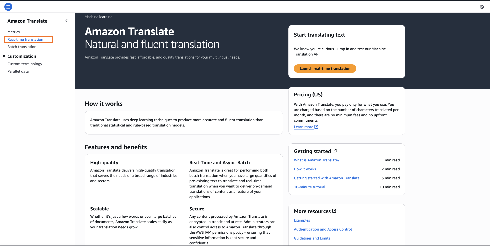

1. In the Amazon Translate console, locate the real-time translation section. You will see a lot of options available to you for source and target languages.
   
   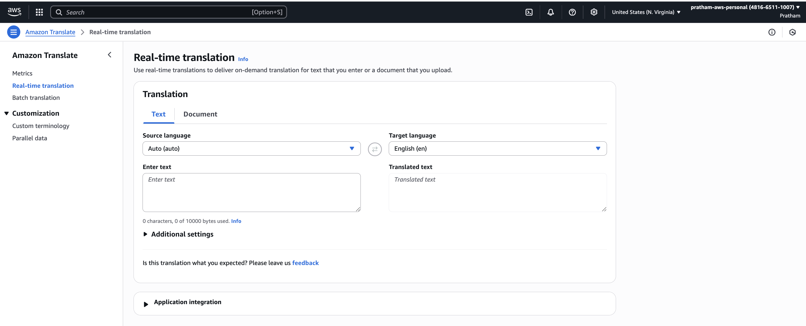

2. For this example, we will translate from **English** into **French**. Select `"English"` for the source language and `"French"` for the target language.

3. In the source language text box, enter the phrase, `"Hello, how are you?"`

4. Observe the target language text box. The service automatically provides the translation: `"Bonjour, comment allez-vous?"`

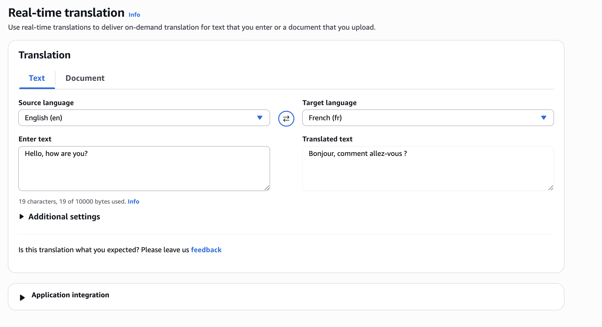

**Key Takeaway:** As you can see, this is working easily and provides instant feedback for translating short text snippets.

### Translating Entire Documents

You can also translate entire documents, which is a very handy feature.

1. In the console, navigate to the document translation section.
   
   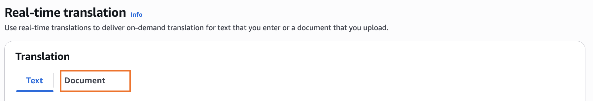

2. Again, you would choose the `"source language"` and the `"target language."`

3. Next, you would upload a file from your computer.

4. Specify the document type. The supported formats are `"plain text, HTML or docx."`

5. Once you initiate the process, your document would be translated.

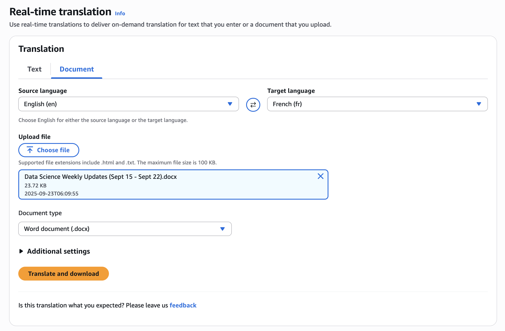

### Running a Batch Translation Job

For translating many different files at the same time, you can perform a batch translation. This is set up as a translation job.

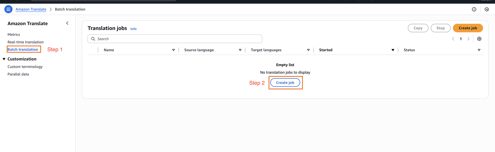

1. From the `"Batch translation"` section, you would start by creating the job.

2. Again, specify the `"source"` and the `"target language."`
   
   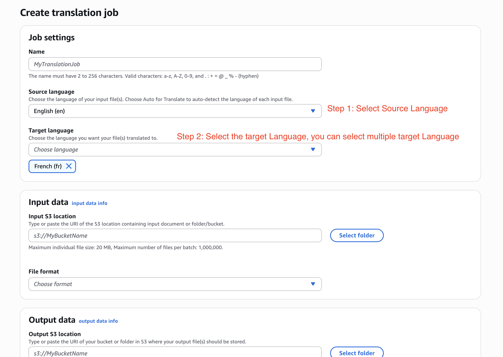

3. Here, the input data would be an `"Amazon S3 bucket."` You would put all your documents that you want to be translated into this bucket. You also need to specify their formats.

4. Finally, you would say where in Amazon S3 you want the translations to be stored. This is the output location for the translated files.

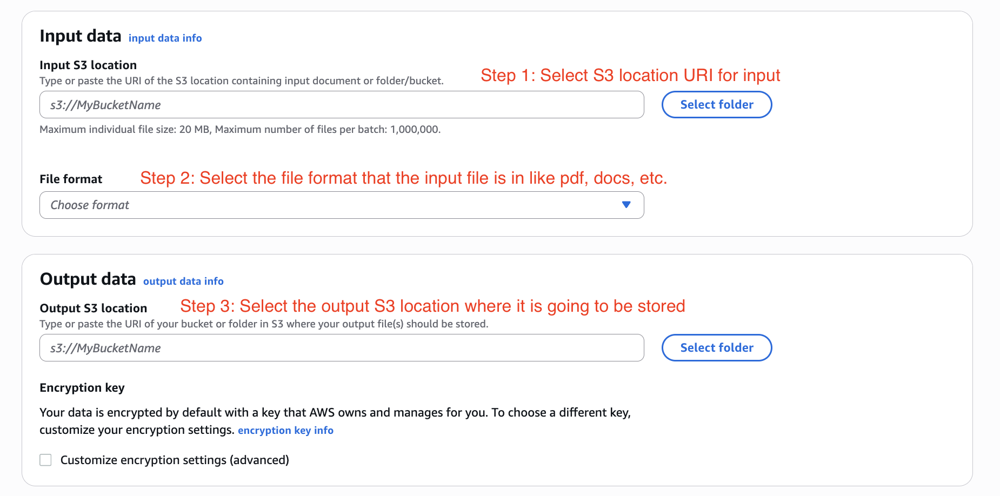

**Key Learning:** This feature is very helpful when you want to do a translation of many different files at the same time. For this demonstration, we will just cancel this job.

### Monitoring with Metrics

It's important to have a look at whether Amazon Translate is doing its job correctly. The **<u>metrics</u>** section allows you to monitor its performance.

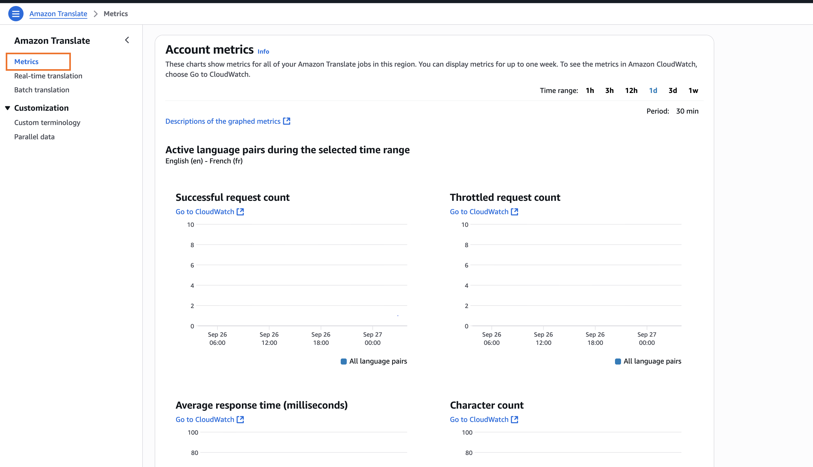

1. Navigate to the "Metrics" section in the console.

2. Here, you can view how many requests for translation have been "successful" or "unsuccessful."

### Customizing Translations

Now, we can look at how to customize the service.

#### **Custom Terminology**

Your **<u>brand name</u>**, your **<u>character's name</u>**, or **<u>your unique content</u>** may have <mark><u>unique translations</u></mark> into <u>other languages</u>. To handle this, you can create a dictionary, called a **"terminology"** here.

1. Navigate to the "Custom terminology" section.
   
   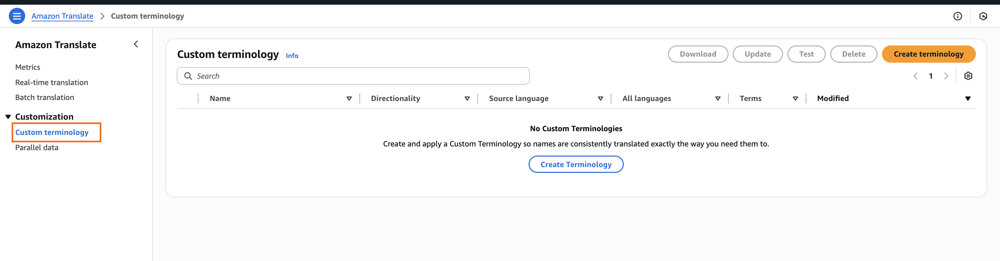

2. You would create your terminology file, which can be in "CSV format, or TSV format or TMX format."
   
   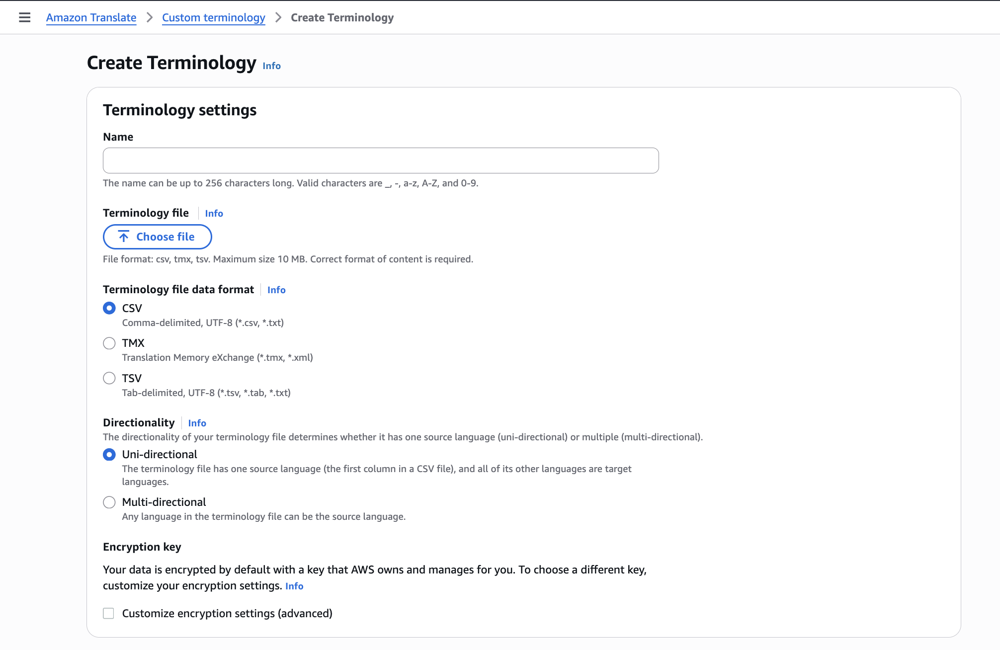

3. By providing this file, you will help Amazon Translate learn how to translate your specific terms and use that custom translation.

#### **Parallel Data**

This is more around **how you want to customize the *style* of the translation**. This allows you to influence the **formality** and **phrasing** of the output.

<u>Instructor's Example</u>:

The service gives a very good example. The English sentence, "How are you?" can be translated in different ways in French depending on the context.

- In a very **informal context**, it would be "**Comment Ça va?**", which is a very easy and informal way of saying, "How are you?"

- But if you are in a more formal setting, like a **law office**, you may want to translate it into "**Comment allez-vous?**", which is the more formal way of saying "How are you?" in French.

This "Parallel data" section is where you would set up these stylistic rules to guide the translation engine.

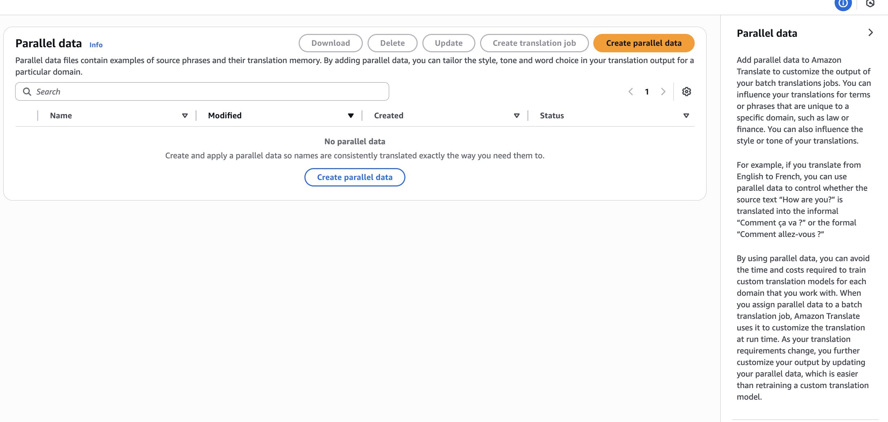

### Summary

This was a high-level overview, but the goal was to give you an overview of how the service works and what it can do. As you can see, Amazon Translate is quite a straightforward service. I hope you liked it, and I encourage you to try it around on your own.
