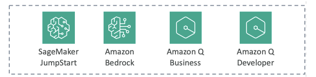
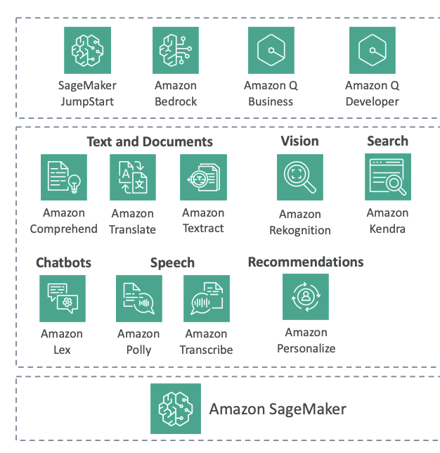

# AWS AI Managed Services

In this section, we're going to see a lot more AWS AI managed services. 
So why do we want them? 
These services are **pre-trained machine learning services** that are geared towards **very specific use cases**. For example, we've seen that we have Amazon Bedrock to do GenAI, and we have even seen higher level GenAI services, such as Amazon Q Business and Amazon Q Developer. We'll have a look soon at SageMaker, but you may want to do other things than GenAI, and so there are lots of services that we'll learn about in this section.

## **AWS AI Service Categories**

### **Text and Document Processing**
- **Amazon Comprehend** - Process text
- **Amazon Translate** - Language translation
- **Amazon Textract** - Document processing

### **Vision Services**  
- **Amazon Rekognition** - Image and video analysis

### **Search and Communication**
- **Amazon Kendra** - Intelligent search
- **Amazon Lex** - Chatbot creation

### **Speech Services**
- **Amazon Polly** - Text-to-speech
- **Amazon Transcribe** - Speech-to-text

### **Personalization**
- **Amazon Personalize** - Recommendation engine

### **Complete Machine Learning Platform**
- **Amazon SageMaker** - Comprehensive ML service (a huge service in AWS)

## **Why Use AWS AI Managed Services?**

You can do everything on your own computer or on your own server in the cloud, but you may want to use these services for several key reasons:

### **Responsiveness and Availability**
- Available in many different regions 

### **Redundancy and Regional Coverage**
- Always available with built-in redundancy
- Deployed across multiple Availability Zones
  - Meaning that if there is a failure in the cloud, then these services may still work

### **Performance Optimization**
- Specialized CPUs and GPUs embedded in these services
- Optimized for best cost savings for your use case

### **Cost-Effective Pricing**
- Most services use token-based pricing
  - Meaning that you **Pay only for what you use**
  - Because you No need to over-provision servers for your use case

### **Provisioned throughput**
- Option for provisioned throughput on some services
- These are for predictable workloads that provides more cost savings 
- And Delivers more predictable performance

> **What are Predictable Workloads?** 
> Predictable workloads are applications with consistent, large-scale usage patterns that need guaranteed throughput and performance

## **Exam Perspective**

AWS will want you to know about these services from an exam perspective, and this is what we're going to explore in this section.