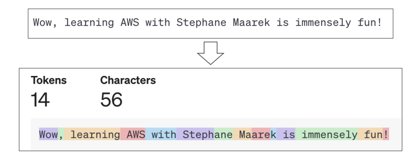
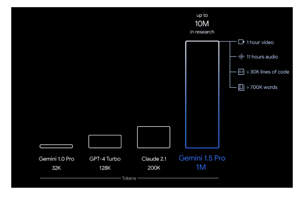
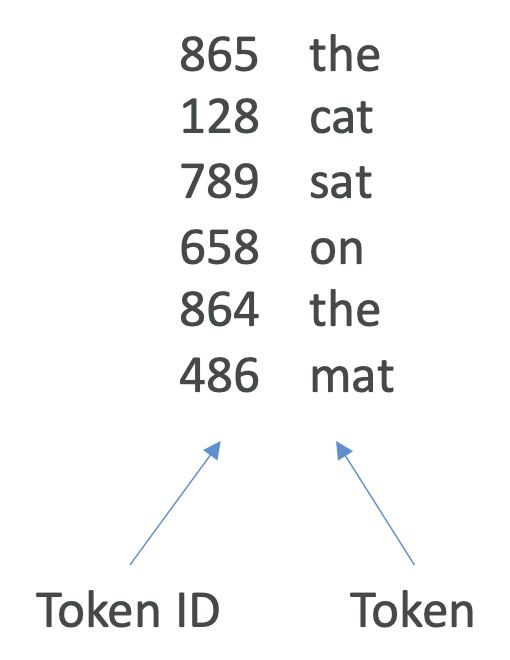
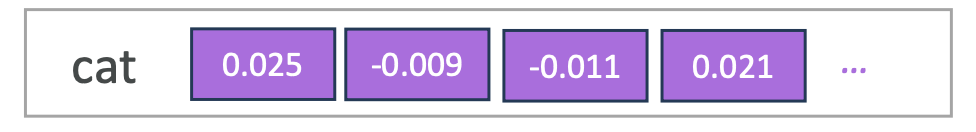
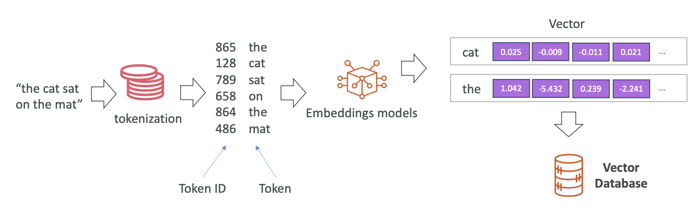
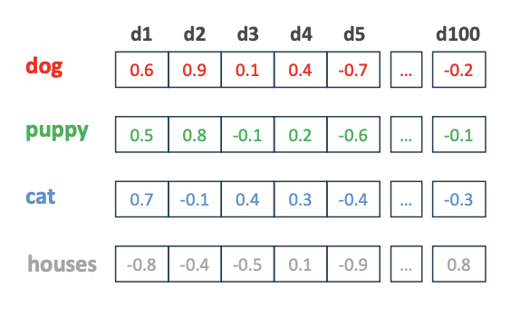
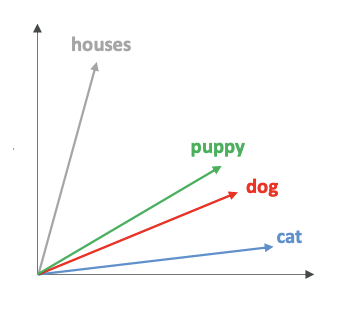
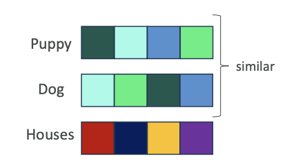
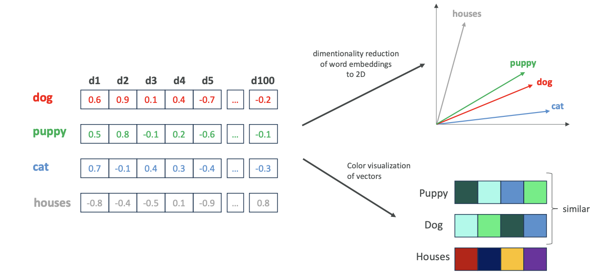

# More GenAI Concepts

Now that we've seen Gen AI and how to use it, let's look at the bigger concepts around it. These concepts are more theoretical but are very important to understand, as the exam may ask a few things about them.

### **The Process of Tokenization**

**Tokenization** is the <u>idea of converting raw text into a sequence of tokens</u>. For example, take the sentence, `"Wow, learning AWS with Stephane Maarek is immensely fun."` There are different ways to convert these words into tokens.

- **Word-Based Tokenization:** The <u>text</u> is split into <u>individual words</u>.

- **Subword Tokenization:** 
  
  Some words can be split into smaller parts. This is very helpful for long words and allows the model to have a smaller total number of tokens. 
  
  - For example, the word `"unacceptable"` can be understood as the combination of a negative prefix `"un-" `and the token `"acceptable."`

You can experiment with this on the OpenAI website called [Tokenizer](https://platform.openai.com/tokenizer). Using the sentence, "Wow, learning with Stephane is immensely fun!," we can see how it's broken down:

Tokenization is important because each **token is assigned an ID**, which is much <u>easier for the model to deal with than the raw text itself</u>.

### **Context Window**

The **context** is the <u>number of tokens that an LLM can consider when generating text</u>. Different models have different context windows, and a <u>larger window</u> allows for <u>more information</u> and <u>coherence in the output</u>. It's a race now to have the greatest context window because it allows more information to be fed to the model.

- **GPT-4 Turbo:** 128,000 tokens

- **Claude 2.1:** 200,000 tokens

- **Google Gemini 1.5 Pro:** 1 million tokens (and up to 10 million tokens in research)
  
  

A context window of 1 million tokens means you can feed the model a one-hour video, 11 hours of audio, over 30,000 lines of code, or over 700,000 words. 

While a **large context window** provides more benefits, it also requires **more memory and processing power**, which **may cost more**. When you consider a model, the context window is probably the first factor to consider to make sure it fits your use case.

### **Embeddings**

Embeddings are about creating a **vector**—<u>an array of numerical values</u>—out of text, images, or audio.

The process generally works like this:

1. **Start with Text:** For example, "the cat sat on the mat."

2. **Tokenization:** Each word is extracted as a token: "the", "cat", "sat", "on", "the", "mat".

3. **Assign Token IDs:** Every token is converted into a numerical ID from a dictionary (e.g., "the" is 865).
   
   

4. **Embeddings Model:** An embeddings model creates a unique vector for each token. The token "cat" is converted into a large vector of numerical values (e.g., [0.025, ...]). look at the image below:
   
   

5. **Store in Vector Database:** All these vectors are stored in a vector database.

The whole flow looks like this:

#### **Why Convert Tokens into Vectors?**

When we have vectors with very high dimensionality (e.g., 100+ values), we can encode many features for a single input token.

- The meaning of the word

- Its synthetic role

- The sentiment (positive or negative)

- And much more

The model is able to <u>capture a lot of information about the word just by storing it in a high-dimensionality vector</u>. Because these embeddings can be easily searched in vector databases (**using nearest neighbor capabilities**), they are a very good way to power a search application. (**V.V IMP FOR EXAM**)

#### **Semantic Relationships and Similarity**

Words that have a semantic relationship (meaning they are similar) will have similar embeddings. Let's take the tokens `dog`, `puppy`, `cat`, and `house` and create a 100-dimension vector for each. Look at the image below:

It is difficult for us as humans to visualize <u>100 dimensions</u>. To help with this, we sometimes use a technique called **dimensionality reduction**, <u>which reduces the 100 dimensions to two or three</u>. If we did this, we might see a **2D diagram** where:

- `puppy` and `dog` are <u>very closely related</u>.

- `cat` is not too far away from `dog` because it's also an <u>animal</u>.

- `house` is very different and far away on the diagram.

Another way to visualize a **high-dimension vector** is to <u>use colors</u>, where each <u>combination of numbers creates a color</u>. 

Visually, we could see that `puppy` and `dog` have very <u>similar colors</u>, while `house` has a <u>very different color</u>.

The whole flow looks like this:

This shows that there is a semantic relationship between tokens with similar embeddings. Once we have them in a vector database, we can perform a similarity search. If we provide the vector for `dog`, the database can automatically pull all the tokens that have a **similar embedding**.
