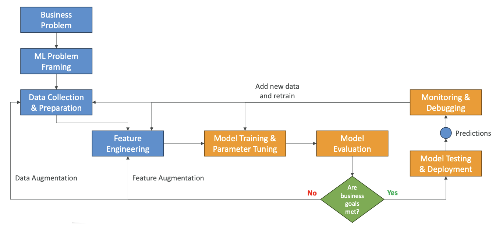
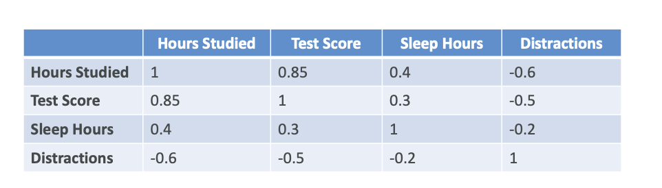
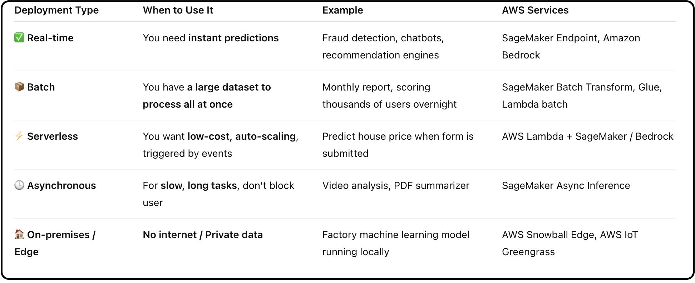

# Machine Learning Project Phases

We have learned a lot about machine learning from a technical standpoint, but now let's talk about the implementation standpoint. 

What are the phases of a machine learning project?

## **Overview of ML Project Phases**

The machine learning project lifecycle follows a structured approach with multiple interconnected phases:

1. **Identify a business problem** we want to solve
2. **Frame that problem** as a machine learning problem
3. **Collect data and prepare** this data
4. **Feature engineering** to transform the data into having features that can be helpful from a machine learning perspective

Once we have prepared the dataset, then we do Model Training

5. **Model training** - this is where we go into the machine learning part
6. **Tune the parameters** of the model (how our algorithm is working)
7. **Evaluate the model** - is it working on our test dataset? Do we get the results that we want?
8. **Ask ourselves**: are the business goals met?

If the business goals are not met, we need to enhance the data to have more data or to have it better prepared. If we need more data, we can do what's called **data augmentation**. If we want to improve the features, we can do **feature augmentation**.

The idea is that you will do this process over and over again. You're going to change your model if needed and tune it better up until you have a **satisfactory model**.

9. **Model Testing & Deployment**: Once the model is satisfactory, you're going to **test it** and then **deploy it**. Once it's deployed, your users can use it, so it starts making predictions.

Even though our users are getting predictions, we want to make sure that we are `Step 10:`**monitoring and debugging** our model because it is possible that the predictions sometimes will not be good, or that it will drift, or that things will change over time. So monitoring and debugging is a **super important phase**.

As we make predictions, if they are correct, we want to `Step 11:` **add this data to our original datasets** (see the diagram below) to make it even better and to retrain our model. So there is a sort of loop that goes on where this new data helps with data collection, it helps with feature engineering, and it helps with the model training.

## **Detailed Phase Breakdown**

### **1. Define Business Goals**
You must have the stakeholders of your project define:
- The **value** of the project
- The **budget** for the project  
- The **success criteria** of your project
- you define **KPI (Key Performance Indicator)** which is critical

### **2. Frame the Problem as a Machine Learning Problem**
There's a conversion that needs to happen, and we need to determine if machine learning is actually an appropriate solution to solve that problem, because sometimes it is not.

This is when the **data scientists, data engineers, machine learning architects, and any subject matter experts** will collaborate to figure out:
- How to convert the business problem into a machine learning problem
- If machine learning is appropriate

### **3. Data Processing**
Once it is a machine learning project, then we need to do data processing:

- **Collect data** and convert it into a usable format
- We need to Make it **centrally accessible in one place** so that we can really analyze it all at once
- **Understand our data** - we need to pre-process it and also do data visualization to understand the type of data we are dealing with (EDA)
- **Feature engineering** - After EDA, we have to do Feature Engineering by creating, transforming, and extracting variables out of the data

### **4. Model Development**
Once the data is ready, we go into model development:

In Model Development, we:
- **Train our model**
- **Tune it**
- **Evaluate it** against our datasets (for example, our test datasets)

It's a very iterative process, and as you develop your model, it's for sure going to feed back into your data processing because these two processes are very intertwined. You're going to do additional feature engineering, and you're going to tune the model hyperparameters. They are the parameters that define how the algorithm is working.

### **5. Exploratory Data Analysis Phase**
One phase that is part of the beginning of your machine learning project is the exploratory data analysis phase:

- **Explore data** and compute statistics
- **Visualize the data with graphs** to really understand the shape it has and how influential it is
- Build what's called a **correlation matrix**

**What is Correlation Matrix?**  

You look at all your variables, all your features, and you're going to compute **how linked they are**. 

For example, if we compare how we studied to the test score, we can see 0.85. That means that whenever the hours studied are increasing, the test score is also increasing a lot. So they're positively correlated. It's not one because one would explain it perfectly, but it gives you an idea.

Another Example: from the diagram, if you sleep a lot, then you are going to have better test score.

This helps you decide which **features can be important** in your model and **how correlated they are**.

### **6. Retraining**
If we retrain, we:
- Look at the data and the features to improve the model
- Adjust again the model training hyperparameters

### **7. Deployment**
If the results are good, the model is going to be deployed and ready to make inferences - that means ready to make predictions for your users.

We select a deployment model. You have:
- **Real-time**
- **Batch**
- **Serverless**
- **Asynchronous**
- **On-premises**

So you select the deployment model you need.

> For better understanding, see the table below:
> 

### **8. Monitoring**
This means deploying a system that will check if your model is operating at the desired level of performance.

With monitoring systems, you can do:
- **Early detection of problems**
- **Early mitigation of problems** so that your users are not impacted
- **Debug issues**
- **Understand the model's behavior** once deployed to production

### **9. Iterations**
The model must be continuously improved and refined as new data becomes available because requirements may change.

For example, imagine that you're doing something around clothing prediction. What is true today in terms of clothing trends may not be true in 10 years. People may wear different types of clothes. So of course, retraining your model and making sure to monitor requirements is very important to do your iteration and making sure the model is accurate and relevant over time.

---

Now you know how to conduct properly a machine learning project.