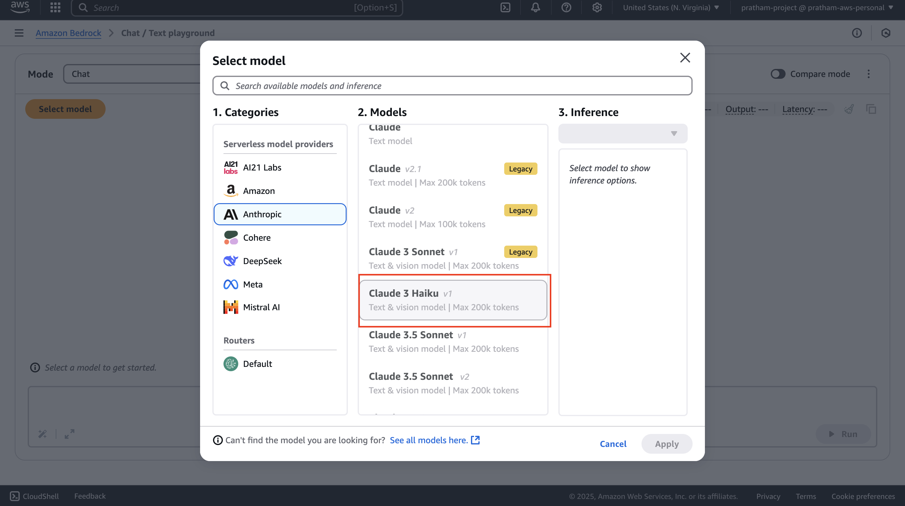
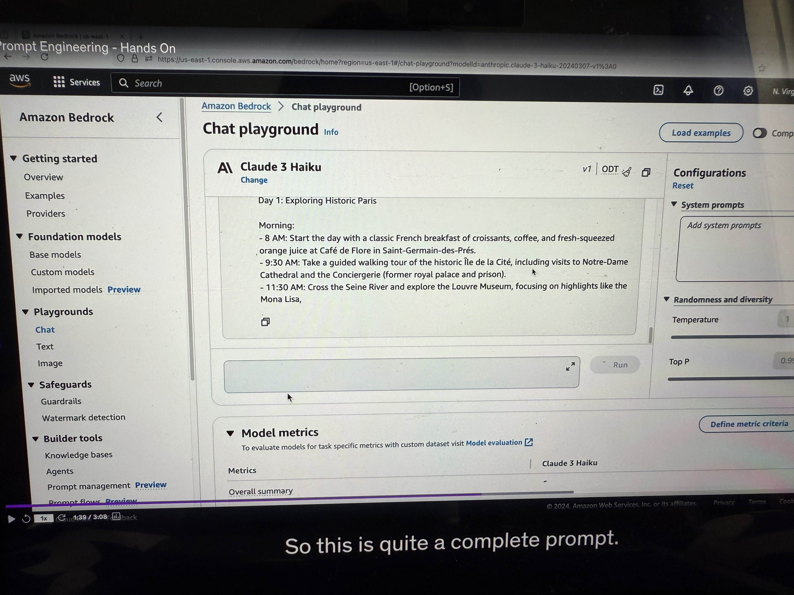
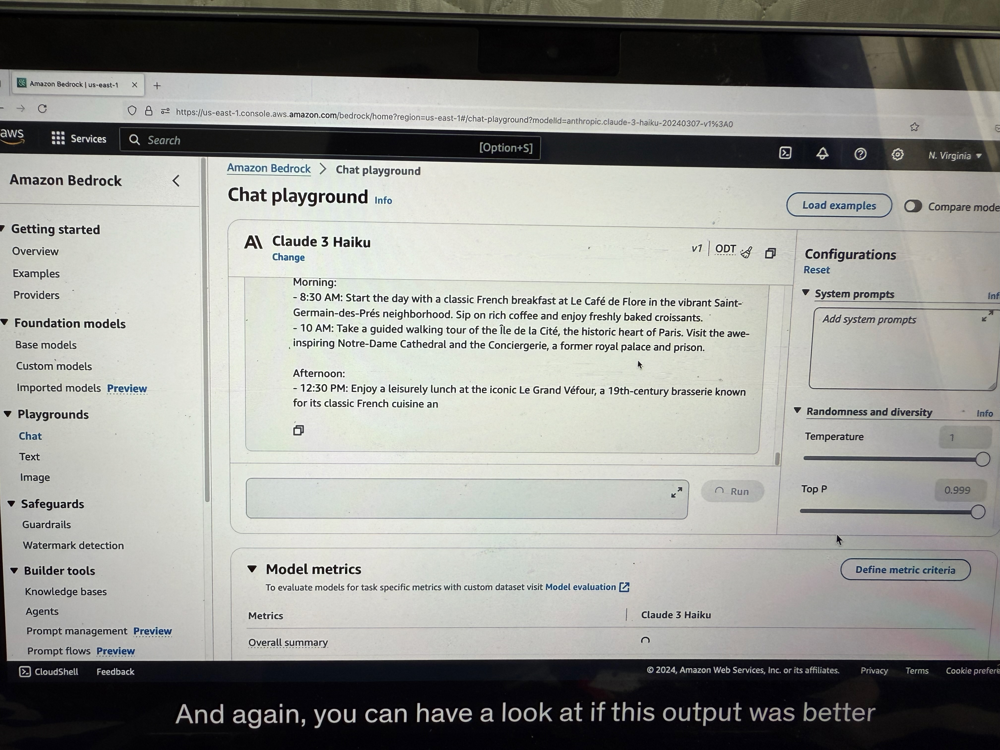

# Prompt Engineering - Hands On

Okay, so let's practice how to do good prompting. We're going to go into **chats** and select a **model**. We're going to select **Anthropic**, and then we select **Claude 3 Haiku**.

## **Naive Prompt Example**

Let's start with a basic example. We'll just write a prompt: `"write me a travel itinerary."`

This prompt is very naive - it's not very detailed. Here the model just responds with a seven-day trip showing Rome, Florence, and Venice in Italy. This is an answer that is possible for us to deal with, but it's not the one I want because I was not very precise.

## **Using the Prompting Framework**

Instead, we want to use the framework we had of giving instructions, giving context, giving input data, and then giving an output format. (as seen in previous lecture)

Under our code, under prompting, I've created prompting.txt, and we're going to use the first format - the instructions, the context, and the output.

### **Enhanced Prompt Structure**
(See the example in the picture, below are explanations provided explaining how to do prompt engineering)
**Instructions:**
Please create a three-day itinerary for Paris, France. It should include visits to historical landmarks, art museums, and popular local restaurants. You want good balance, you want to have suggestions for breakfast, lunch, and dinner.

**Context:**
We've never traveled to Paris before and we want to experience both the well-known and hidden gems. Of course, some people who have already been to Paris may want something different, so the **context is very important**.

**Input Data:**
Right now is just a three-day trip to Paris. But we may want to add articles that we've read in the news, and this would be a good way to enhance the outcome of this prompt.

**Output Indicator:**
We want the travel itinerary with specific times, locations, descriptions, and dining recommendations.

### **Results of Enhanced Prompting**

This is quite a complete prompt. As you can see, now the model is telling us a lot (see the image below) of things about what to do on each specific day. This is quite nice because we are getting the recommendation we want for the exact prompt we cared about. It really shows you the difference of quality between a good and a bad prompt.

## **Adding Negative Prompting**

Now, we also must include, if we want to improve it, negative prompting. Negative prompting is what do we not want to see? (see the example image below)

### **Negative Prompting Example:**

Here, for example: 
• Do not include activities that are primarily for children or families 
• Avoid overly touristy restaurants   
• Include anything that requires too much travel, except Versailles 

Let's paste it and run it. Again, you can have a look at whether this output was better than the previous one or not based on the negative prompting.

## **Creative Negative Prompting**

We can do any kind of creative negative prompting. For example, we can say: 
• Here's the instructions 
• Do not recommend more than three activities per day 

We run it, and again, with the negative prompting, now we're getting fewer activities per day. So it's a bit shorter day and maybe we'll have more time to do stuff in Paris.

## **Conclusion**

I cannot tell you if this is a good recommendation or not. I lived in Paris, but AI can be sometimes surprising. Anyway, if you would trust AI to organize your next travel, you know how to do it now and you know how to properly build a prompt for it.