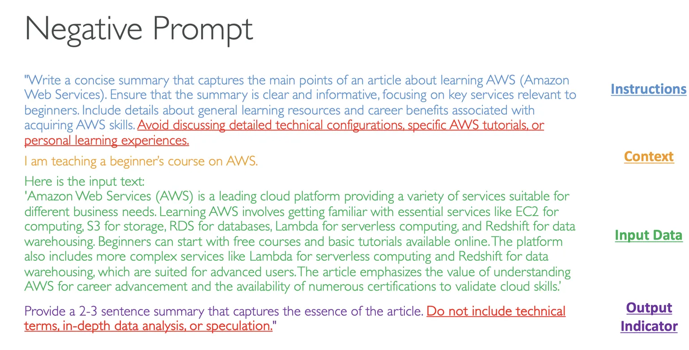

# What is Prompt Engineering?

## Introduction to Prompt Engineering

So now let's talk about Prompt Engineering. What is Prompt Engineering exactly? Well, say we have a naive prompt, for example, "summarize what is AWS," and we submit this prompt to our LLM. This prompt is okay - we're going to get an answer from the LLM, but is it the answer we really want?

Prompting with this type of prompt will give little guidance and leaves a lot to the model's interpretation. So we can do Prompt Engineering, which means we're going to develop, design, and optimize these kinds of prompts to make sure that the foundation model's output will fit our needs.

## **The Four Blocks of Improved Prompting**

To have an improved prompting technique, we have four blocks:

1. **Instructions** - What is the task for the model to do? We describe how the model should perform the task.

2. **Context** - What is external information to guide the model?

3. **Input Data** - What is the data for which we want a response?

4. **Output Indicator** - What is the type or format of the output that we want?

All these things together are going to give us a much better prompt and a much better answer.

## **Enhanced Prompt Example**

Here is a concrete example where we are going to improve our naive prompt:

### Instructions
Instead of just asking what AWS is, we want to write a concise summary that captures the main points of an article about learning AWS. We need to ensure that the summary is clear and informative, focusing on key services relevant to beginners, including details about general learning resources and career benefits associated with acquiring AWS skills.

### Context
I am teaching a beginner's course on AWS, so therefore, the model will respond in a way that can be understood by beginners.

### Input Data
Here is some input data about AWS - this is what I want the foundation model to summarize:

"Amazon Web Services (AWS) is a leading cloud platform providing a variety of services suitable for different business needs. Learning AWS involves getting familiar with essential services like EC2 for computing, S3 for storage, RDS for databases, Lambda for serverless computing, and Redshift for data warehousing. Beginners can start with free courses and basic tutorials available online. The platform also includes more complex services like Lambda for serverless computing and Redshift for data warehousing, which are suited for advanced users. The article emphasizes the value of understanding AWS for career advancement and the availability of numerous certifications to validate cloud skills."

### Output Indicator
I want the foundation model to provide a 2-3 sentence summary that will capture the essence of the article.

This is great because I'm very clear - I have provided very clear instructions, good context, input data, and an output indicator. Therefore, when I use it on my LLM, I will get the expected output, which are 2-3 sentences that summarize what AWS is based on this article from a beginner's context.

## **Negative Prompting Technique**

Next, we have the technique called Negative Prompting. This is a technique where we explicitly instruct the model on what not to include or do in its response.

### Benefits of Negative Prompting:

• **Helps to avoid unwanted content** - We specify explicitly what we don't want and therefore reduce the chances of irrelevant or inappropriate content

• **Maintains focus** - We make sure that the prompt and the model will stay on the topic

• **Enhanced clarity** - For example, we can say "Don't use complex terminology" or "Don't use detailed data," so we can make the output clearer

## **Enhanced Prompting with Negative Prompting**

Let's look at the enhanced prompting from before, but now we're going to add negative prompting:

### Instructions (Enhanced)
The instructions are going to be exactly the same as before, but now I'm going to add: "Avoid discussing detailed technical configurations, specific AWS tutorials, or personal learning experiences."

### Context, Input Data
The context and input data will stay the same.

### Output Indicator (Enhanced)
For the output indicator, I'm going to say: "Provide a 2-3 sentence summary that captures the essence of the article. Do not include technical terms, in-depth data analysis, or speculation."

As you can see, by adding negative prompting, we are even more clear about what we want and what we don't want in an output from an LLM.

## **Conclusion**

That's it for this lecture on Prompt Engineering. I suggest that you try a little bit on your own to see what you can and cannot get out of this technique.