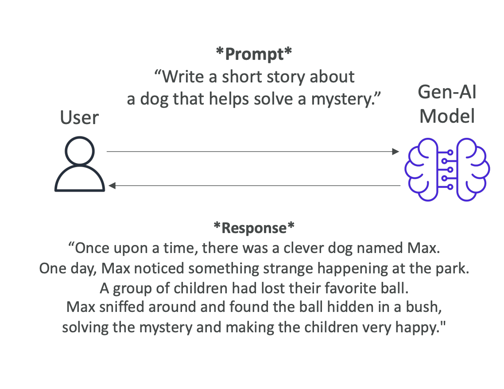
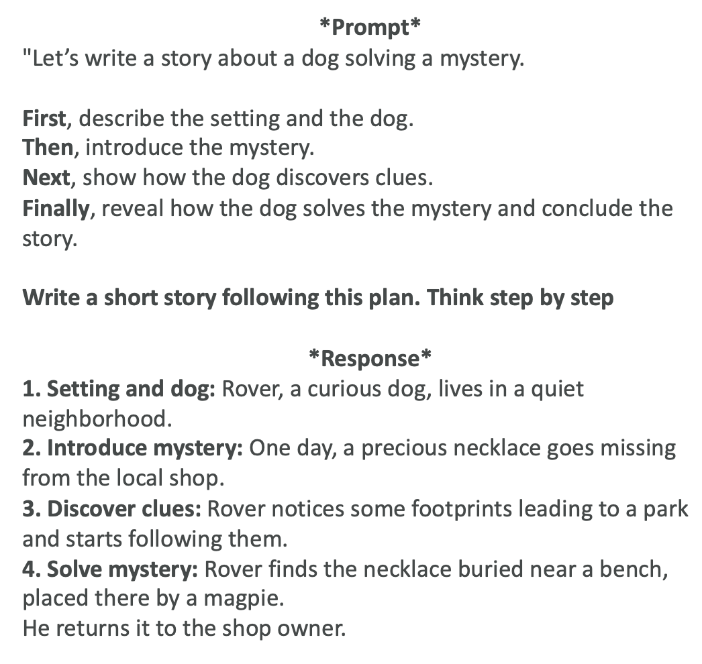
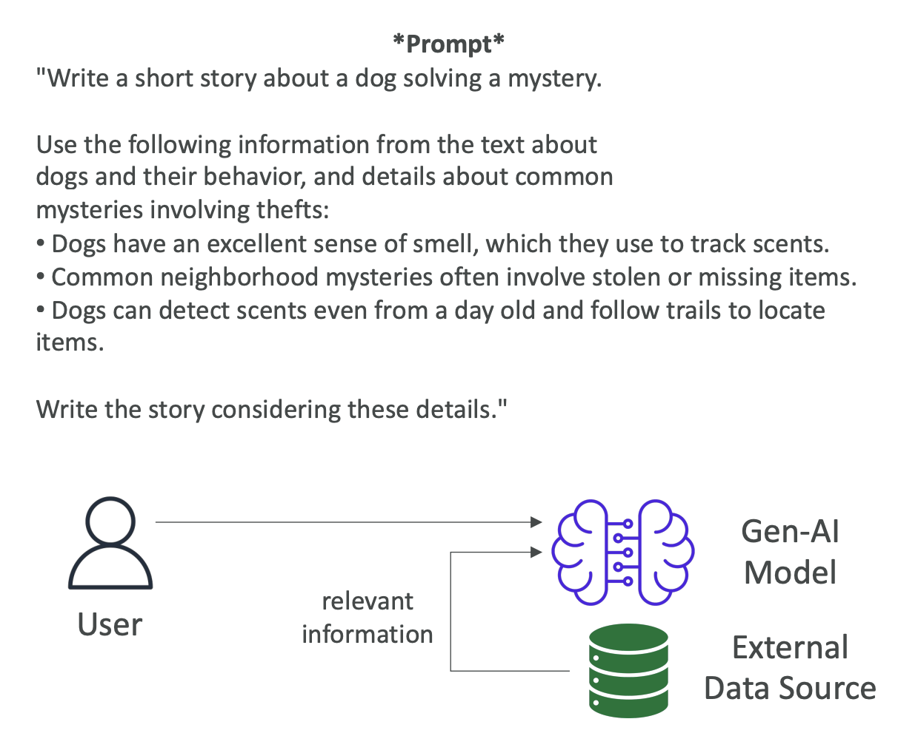

# Prompt Engineering Techniques

## Introduction

So let's have a look at more prompt engineering techniques to improve your prompt. We're going to explore several advanced techniques that can help you get better outputs from your Gen-AI models.

## **Zero-Shot Prompting**

This is to present a task to a model without providing any examples or explicit training for that specific task. We have a very general Gen-AI model, a foundation model, and for example, we say "write a short story about a dog that helps solve a mystery."

Then we get a response from the Gen-AI model. For example:

 "Once upon a time, there was a clever dog named Max. One day, Max noticed something strange happening at the park. A group of children had lost their favorite ball. Max sniffed around and found the ball hidden in a bush, solving the mystery and making the children very happy."

### Key Characteristics:
• We rely fully on the model's general knowledge 
• The larger and more capable the foundation model, the more likely we're going to get good results 
• It's called zero-shot prompting because we go right away and present our prompt 

## **Few-Shot Prompting**

Here we provide examples of a task to the model to make sure we have guided its outputs. That's why it's called few-shot because we provide a few shots to the model to perform the task.

### Example Structure:

Let's take the exact same prompt as before, but now we're going to use the few-shot prompting technique. We say "here are two examples of stories where animals help solve mysteries":

1. **Whiskers the Cat** noticed the missing cookies from the jar. She followed the crumbs and found the culprit...

2. **Buddy the Bird** saw that all the garden flowers were disappearing. He watched closely and discovered a rabbit...

Then we say: "Write a short story about a dog that helps solve a mystery."

### Benefits:
• Because we have provided a few shots to the Gen-AI model, it's able to respond in a way that follows the few shots we have provided before
• This is a good technique when you know exactly what kind of output you want and you want the model to write based on examples you provide
• If you provide only one example, this is also called **one-shot** or **single-shot prompting**

## **Chain of Thought Prompting**

Here we divide the task into a sequence of reasoning steps leading to more structure and coherence. When we use a sentence in our prompt, such as "think step by step," this will help the model go into chain of thought prompting.

### When to Use:
This is very helpful when you want to solve a problem as a human, and that usually requires several steps.

### Example Structure:

Let's again do our prompt that would say, "let's write a story about a dog solving a mystery." But then we say:
1. First describe the setting and the dog
2. Then introduce the mystery
3. Next show how the dog discovers clues
4. Finally reveal how the dog solves the mystery and concludes the story

And so therefore we say, "write a short story following these steps, think step by step," and the response will follow this structure.

### Additional Notes:
• This is chain of thought prompting
• This can be combined with zero-shot or few-shot prompting if you wanted to

## **Retrieval-Augmented Generation (RAG)**

Here we combine the model's capability with external data sources in order to create a more informed and contextually rich response.

### How RAG Works:
As a reminder, we go and ask something to the Gen-AI model, and some parts of the model is going to retrieve relevant information from an external data source. Then we add this as an enhanced prompt, an augmented prompt, and then we get the answer from it.

### RAG Example:

We say "write a short story about a dog solving a mystery" and then "use the following information from the text about dogs and their behavior and details about common mysteries involving theft."

**External Information Provided:**
• Dogs have an excellent sense of smell, which they use to track scents 
• Common neighborhood mysteries often involve stolen or missing items   
• Dogs can detect scents even from a day old and follow trails to locate items 

Then we say "write the story considering these details."

### Results:
Of course, the story is going to be guided towards dogs having a great sense of smell and locating missing items. This information can come from an external data source and that is being added. This is what's called augmented generation - it's being augmented into our main prompt.

We've seen RAG already at length in the Bedrock session, but it was good to see it again here as a little reminder.