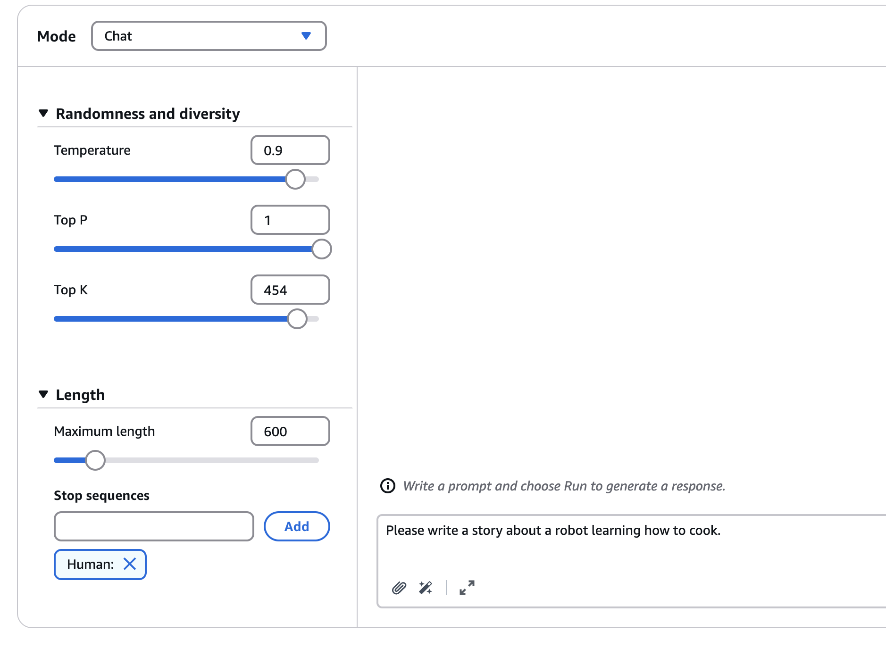

# Prompt Performance Optimization - Hands On

Now that we are hands-on with prompt engineering, let’s practice using different configurations to see how we can influence the creativity of a model using Claude 3 Sonnet on AWS.

### **Initial Setup**

* We select **Claude 3 Sonnet** from **Anthropic** as our model.

* The prompt we enter:
  `"Please write a short story about a robot learning how to cook."`
* We define the story to be **short**.
* The **maximum length** is set to **600 tokens** to ensure brevity.

### **Running with Conservative Settings**

We begin with **low creativity settings** by configuring:

* **Temperature**: Low
* **Top P**: Low
* **Top K**: Low

> These settings are known to generate more **conservative** and predictable outputs.

**Result**:

* The model outputs a story with a **kitchen scene**, a **chef**, and a robot.
* While the output looks interesting at a glance, it reads as **plain and potentially boring**.

### **Increasing Creativity**

Now we modify the settings to boost the model’s creativity:

* **Temperature**: Increased
* **Top P**: Set to maximum
* **Top K**: Set to **500**

> These changes allow the model to explore a **wider range of vocabulary** and **creative paths**.

**New Prompt (same as before)**:

* `"Please write a short story about a robot learning how to cook."`

**Result**:

* The output becomes **much more creative**.
* Elements include:

  * **Optical sensors**
  * A **human instructor**
  * Cooking **crepes**
  * The robot even tries **eating** the food

### **Comparison and Summary**

* Both **low-temperature** and **high-temperature** prompt outputs will be saved in the code directory for comparison.
* This exercise shows **how different configurations affect the output**.

---

### **Key Takeaways**

* **Temperature**: Controls the **overall creativity** of the model.
* **Top P**: Determines the **percentile** of word probabilities considered.
* **Top K**: Specifies **how many words** are considered for the next word prediction.

> Hopefully, this demonstration helped you understand how model configurations influence outputs.