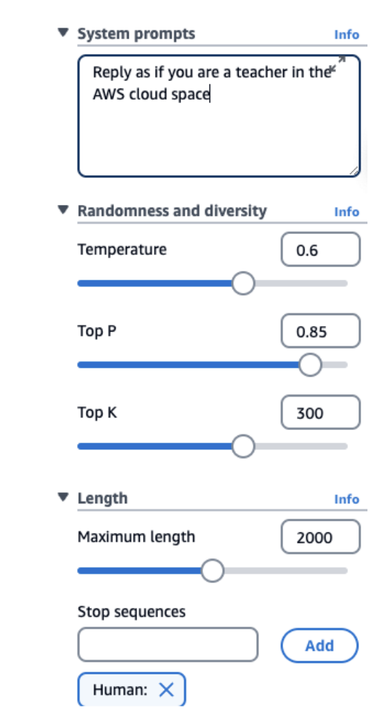

# Prompt Performance Optimization

## Introduction to Text Generation Process

So now let's talk about how we can improve the performance of our prompts in our model. First, let's step back and remember how text is being generated from an LLM.

For example, we have the sentence: "After the rain, the streets were..." and then we have the next word that will be computed by the Gen-AI Model. We can have wet, flooded, slippery, empty, muddy, clean, blocked, and all of these words have associated probabilities for how likely this is going to be the next picked word. 

The Gen-AI Model will do some **probability calculation** and will select a **word randomly**, for example, "flooded"

This is something we've seen and I hope you remember it because now we're going to do a deep dive into that specific process and see how we can slightly influence it.

## Understanding the Core Concepts

Before diving in, let us review core concepts:
### **Temperature vs Top P vs Top K - The Key Differences**

Think of it this way: when the AI is choosing the next word, it has a list of possible words with probabilities (like in your first image).

#### **Temperature** 
- **What it does**: Controls how "random" or "creative" the selection process is
- **How it works**: 
  - Low temperature (0.2) = AI picks the most likely words more often (conservative)
  - High temperature (1.0) = AI is more willing to pick less likely words (creative/risky)
- **Think of it as**: The "boldness" setting - how willing is the AI to take chances?

#### **Top P**
- **What it does**: Limits which words the AI can even consider, based on cumulative probability
- **How it works**:
  - Low P (0.25) = Only consider words that make up the top 25% of total probability
  - High P (0.99) = Consider almost all possible words
- **Think of it as**: The "vocabulary filter" - what percentage of the total probability mass should we include?

#### **Top K**
- **What it does**: Limits which words the AI can consider, based on a fixed number
- **How it works**:
  - Low K (10) = Only look at the 10 most likely words
  - High K (500) = Look at the top 500 most likely words
- **Think of it as**: The "shortlist size" - how many words should we put on the candidate list?

#### **Simple Example**
If the AI is completing "The sky is..." and has 1000 possible next words:
- **Top K = 10**: Only consider the 10 most likely words (blue, clear, dark, etc.)
- **Top P = 0.25**: Only consider words that together make up 25% of all probability (might be just 3-4 words)
- **Temperature = 0.2**: From whichever words made it through Top K/Top P, pick very conservatively (probably "blue")

## **Prompt Performance Optimization Parameters**

Let's go into the prompt performance optimization. This is a screenshot from Amazon Bedrock, and as you can see, we have a few knobs that we can change.

### **System Prompts**
We can specify how the model should behave and reply. In my example, I say "reply as if you are a teacher in the AWS Cloud Space." Of course, we set the tone for the answer, and this will really help the LLM to respond the way we want to.

### **Temperature (0 to 1)**
This is a value you set from zero to one that defines the creativity of the model's outputs.

• **Low Temperature (e.g., 0.2)** - The outputs are going to be more conservative, repetitive, and focused on the most likely response (the words with the highest probability)

• **High Temperature (e.g., 1.0)** - The outputs are going to be more diverse, more creative, less predictable, and also maybe less coherent because it's going to select more words that would be less likely over time

It's for you to try and see what temperature works for you, but think at least, like if you have a high temperature, everything moves and so therefore you have more creativity.

### **Top P (0 to 1)**
Top P is a value again, from zero to one.

• **Low P (e.g., 0.25)** - In the list that we saw before about the next word that can be selected, we will only consider the 25% most likely words. Therefore, we'll have a more coherent response because we only select the words that really make sense.

• **High P (e.g., 0.99)** - We're going to consider a very broad range of possible words, and therefore we have a long list to choose from, so possibly we're going to get a more creative and more diverse output.

As you can see, Temperature, Top P, and then of course, Top K and all the rest of these parameters can be used together.

### **Top K**
Top K is the limit of the number of probable words. While Top P is considering the most likely words as a distribution, Top K is a number.  

• **Low K (e.g., 10)** - You're going to get the top 10 most probable words. You're going to get probably a more coherent response.  

• **High K (e.g., 500)** - You're going to consider the top 500 words. Therefore there's a chance if one of them is selected, that you get a more diverse and more creative answer.  

### **Length**
We define what is the maximum length of the answer. We tell the model to stop at some point.

### **Stop Sequences**
What are some of the tokens that will signal the model to stop generating outputs? If the model has that token, then it stops.

## **Exam Preparation Note**

>From an exam perspective, you need to remember the definition of all of these, what they mean for low and high values. So remember: **Temperature**, **Top P**, **Top K**, **length**, **system prompts**, and **stop sequences**.

## **Prompt Latency**

What about prompt latency? Well, latency means ***how fast the model is going to respond to your inputs***.

### **Factors That Impact Latency:**

• **Model size** - How big or how small the model is  

• **Model type** - For example, Llama is going to show different performance than Claude  

• **Number of tokens in the input** - The more context you give in the context window, the slower it's going to be  

• **Output size** - The bigger the output, the slower as well it's going to be  

### **Important Note About Latency**

These are very important factors, but you should know as well that **latency is NOT impacted by Top P, Top K, or the Temperature parameters**. It's good for you to know because the exam may ask you some questions about it.