# Quiz 1 - Introduction to AWS & Cloud Computing

Question 1:
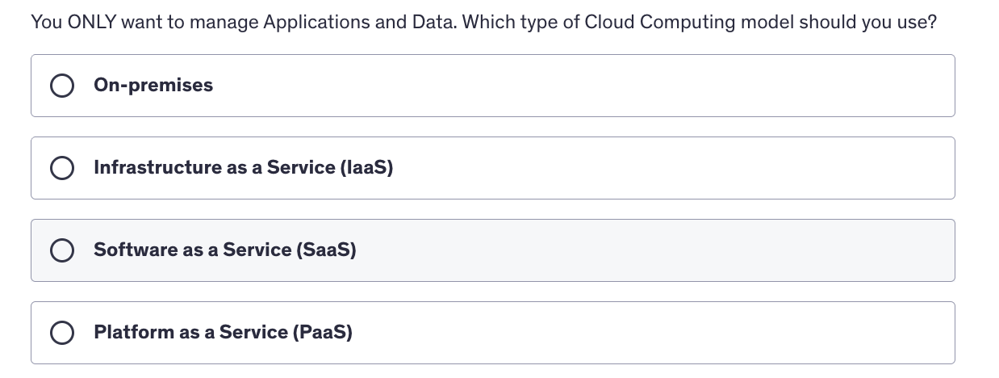

    
Answer
4th Option: Platform as a Service (PAAS) --> In the platform as a service, you only manage the data and the applications

 

Question 2
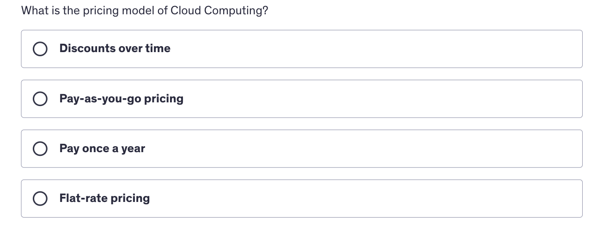

    
Answer
2nd Option: Pay as you go Pricing Model --> In Cloud Computing, you are only charged for what you use

 

Question 3
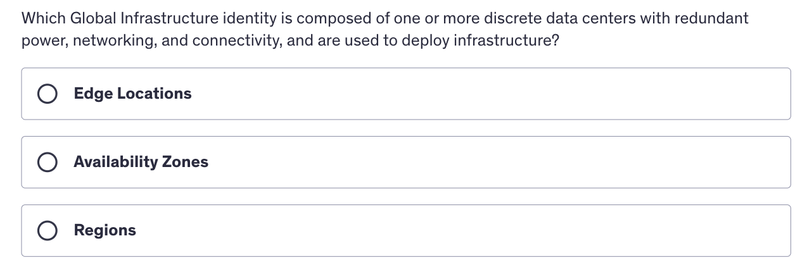

    
Answer
2nd Option: Avalability Zones --> This is the definition of the availability zones

 

Question 4
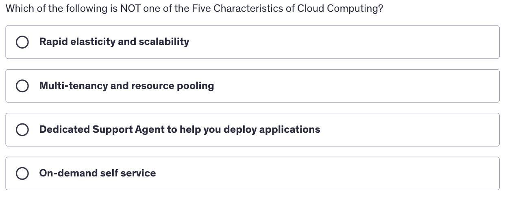

    
Answer
3rd Option

 

Question 5
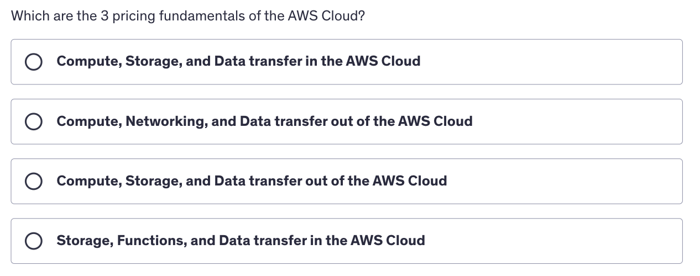

    
Answer
3rd Option

 

Question 6
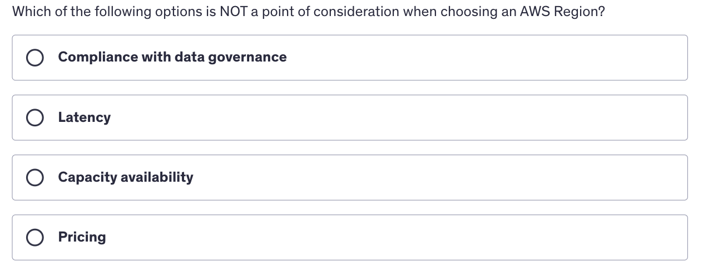

    
Answer
3rd Option

 

Question 7
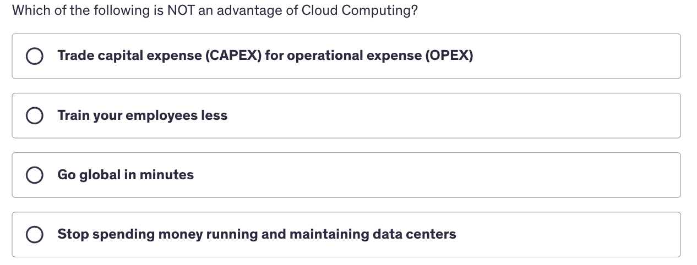

    
Answer
2nd Option

 

Question 8
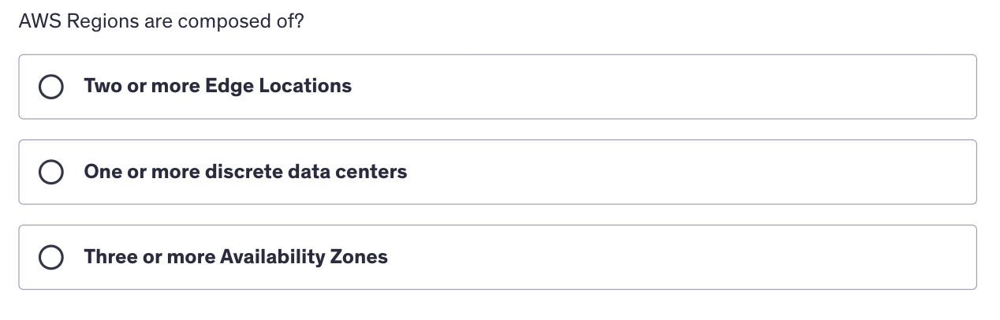

    
Answer
3rd Option

 

Question 9
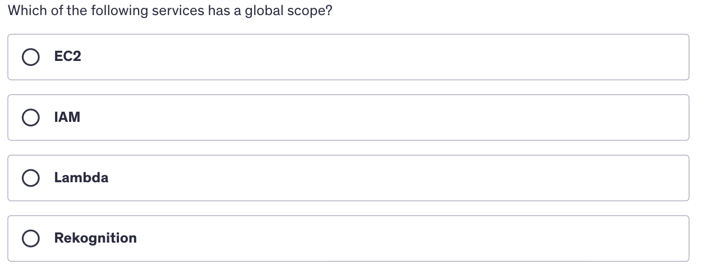

    
Answer
2nd Option

 

Question 10
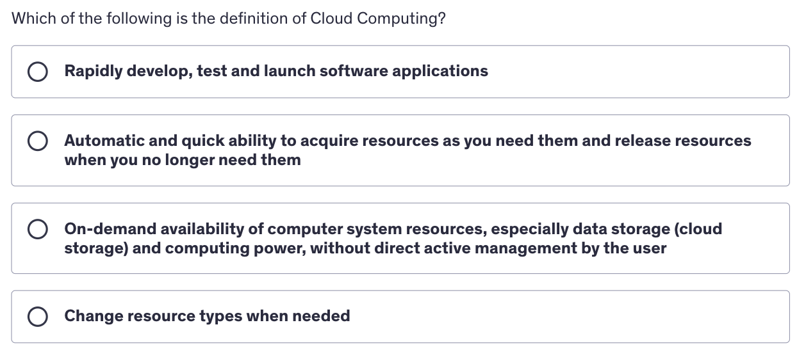

    
Answer
3rd Option

 

Question 11
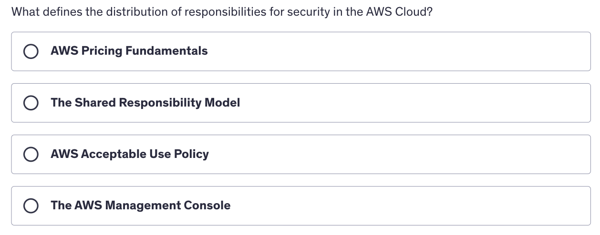

    
Answer
2nd Option

 

Question 12
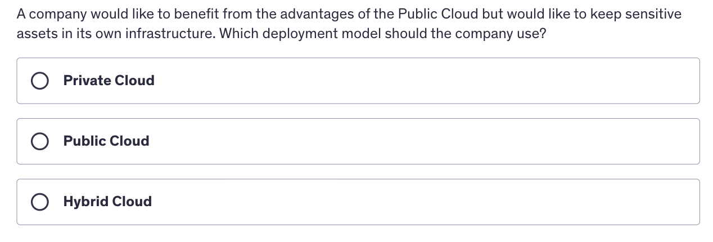

    
Answer
3rd Option

 

Question 13
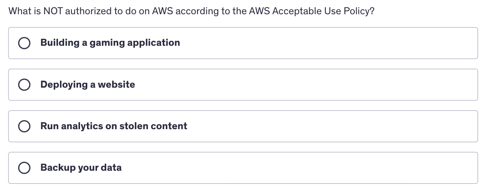

    
Answer
3rd Option

 