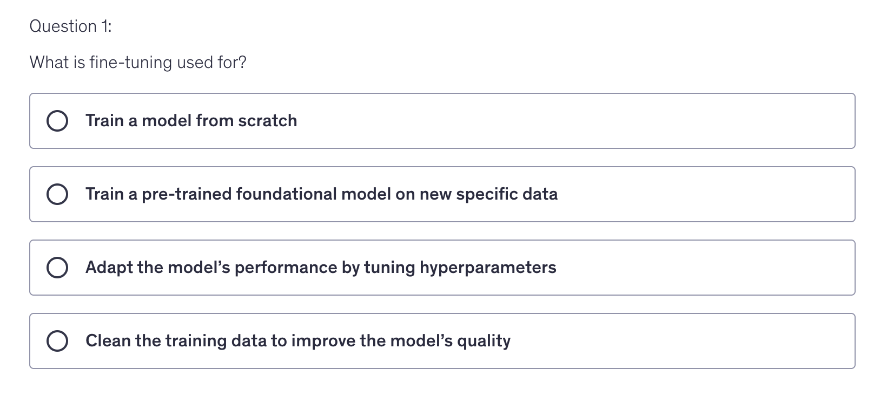
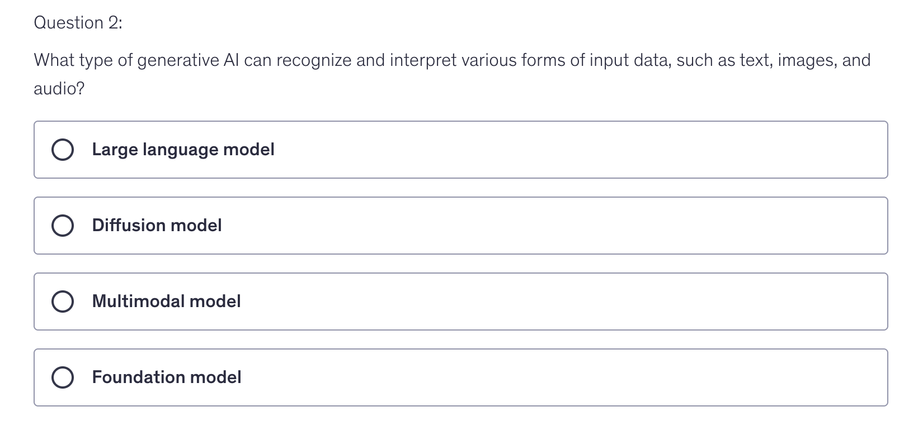
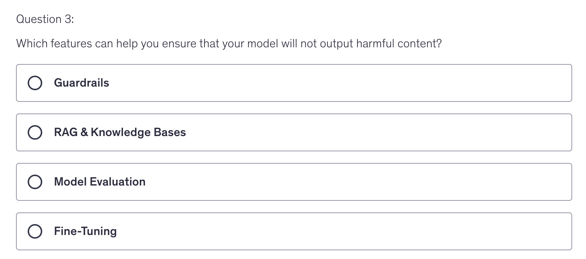
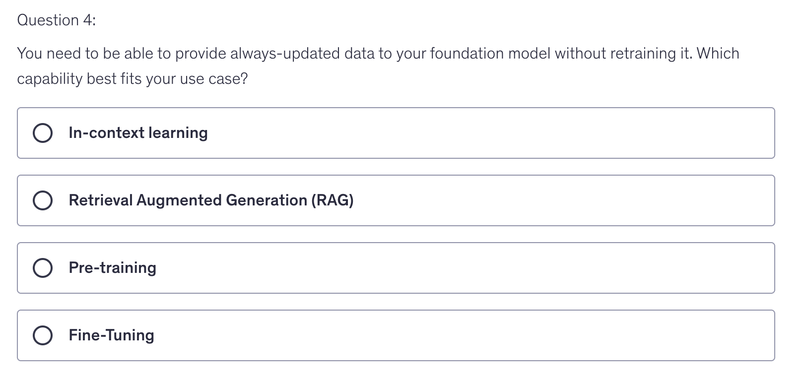
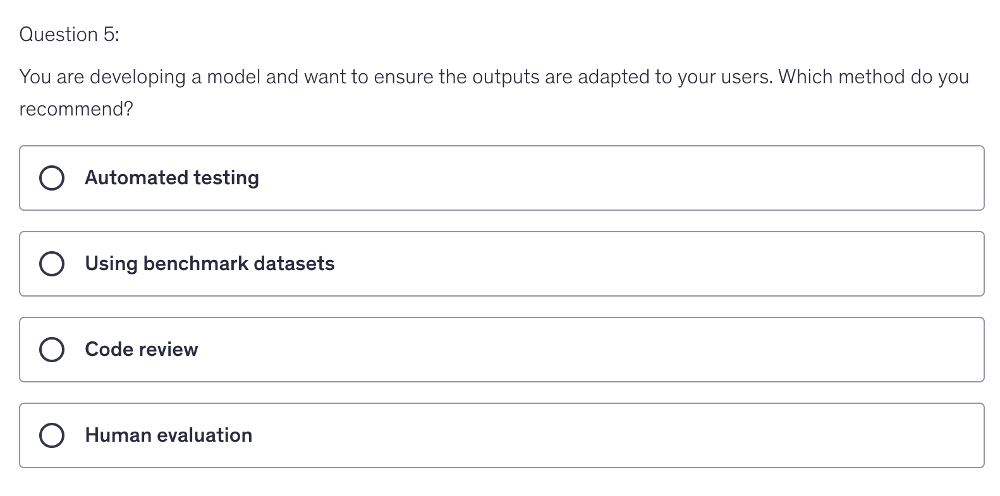
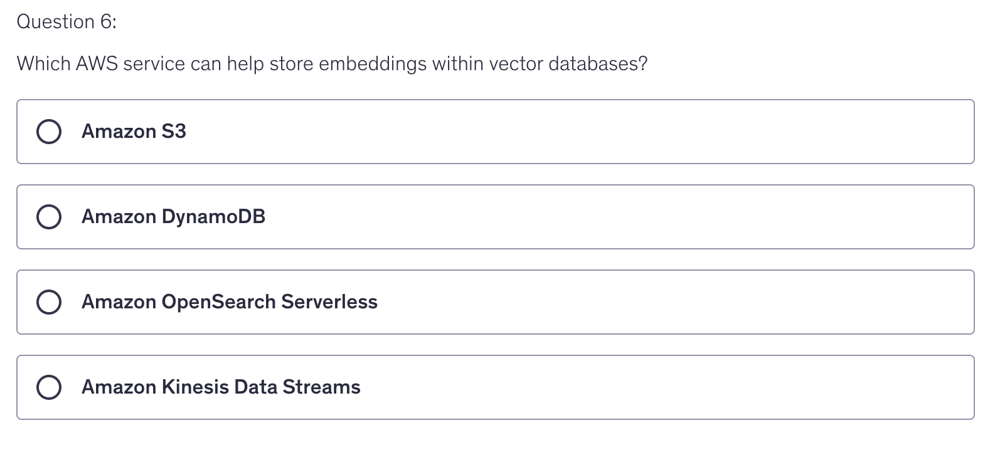
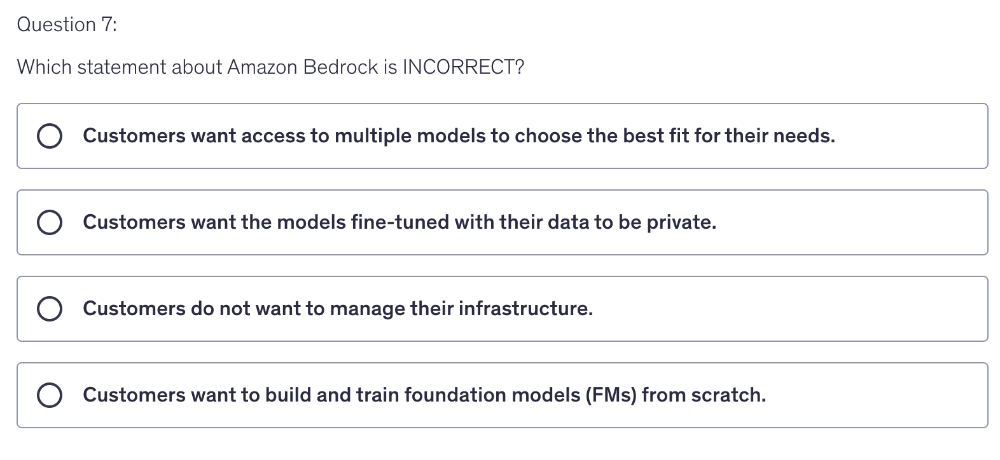
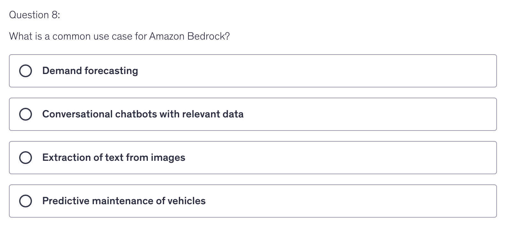

# Quiz 2

Answer

  2nd Option

  
Answer

    3rd Option; I had selected last option : FM, which is wrong why? Here is the reason:
  A "Multimodal model," on the other hand, is explicitly designed to handle and integrate different types of data inputs—such as combining text, images, and audio—within a single architecture. This specialization makes multimodal models suitable for applications that require interpreting and synthesizing information from multiple modalities at once.In summary, while foundation models are versatile and serve as a base for many AI applications, multitask handling of different data types (multimodal capabilities) is a feature of multimodal models.   

  
Answer

   1st Option : Guardrails

  
Answer

     2nd Option : RAG

  
Answer

     4th Option : Human Evaluation; Very tricky question, did not know the answer!

  
Answer

   3rd Option: AWS OpenSearch Serverless

  
Answer

    4th Option; because Bedrock is not used to train models from scratch, Sagemaker is used, and for that there is different exam

  
Answer

     2nd Option

