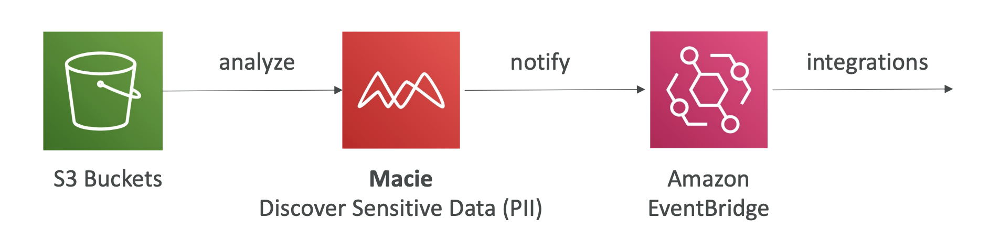

<h1>
  AWS Macie
  
</h1>

Now let's talk about Macie. Macie is a fully managed data security and data privacy service that uses machine learning and pattern matching to discover and protect your sensitive data in AWS.

## **How Macie Works**

The process follows this workflow:

1. **S3 Buckets**: Your PII data will be in your S3 buckets
2. **Analyze**: Macie will analyze the data and discover what can be classified as PII using machine learning and pattern matching
3. **Notify**: Macie will notify you through EventBridge of the discoveries
4. **Integrations**: From EventBridge, you can have integrations into an SNS topic, Lambda functions and so on

## **Key Features**

- **Sensitive Data Discovery**: More specifically, it will alert you around sensitive data such as personally identifiable information, which is named PII

- **Machine Learning & Pattern Matching**: Uses advanced techniques to discover and protect your sensitive data in AWS

## **Primary Use Case**

Macie in this instance will be used to find the sensitive data in your S3 buckets, and that's the only thing it will do.

## **Setup Process**

- **Simple Activation**: It's just one click to enable it
- **Configuration**: You just specify the S3 buckets you want to have and that will be it

That's it for this lecture - very, very short, but that's enough on Macie.