# AWS Config

Now let's talk about AWS Config. 

- Config helps with auditing and recording the <u>compliance of your resources</u> by recording the **configuration** and their changes over time. 
- Any time we've been doing some manual changes of the configuration in AWS, we did not have a list of all the changes that happened, but we can have this using Config.

## **Key Features and Capabilities**

- Configuration data can be stored into **Amazon S3**, which can be later analyzed by **Athena** or to be recovered
- You can receive alerts through **SNS notifications** for **any changes** done to your **infrastructure**
- Config is a **per-region service**, but you can create multiple Config configurations and aggregate all the results **across all accounts and regions**

## **Questions Config Can Solve**

Config and Config rules can resolve important compliance questions such as:
- Is there unrestricted SSH access to my security groups?
- Do buckets have any public access?
- Has my ALB configuration changed over time?

## **Monitoring and Tracking**

### **View Compliance of a resource Over Time**
You can see the compliance of a resource over time. For example, with a EC2 security group (see image below), you can see that it was noncompliant and then after making some changes, it became compliant and green. (see the image below)

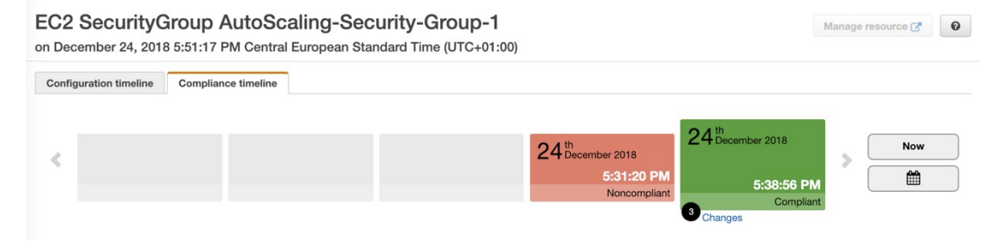

### **View Configuration of resource over time**
- You can view the <u>configuration of a resource over time</u> to see how the **configuration** of that security group has changed.

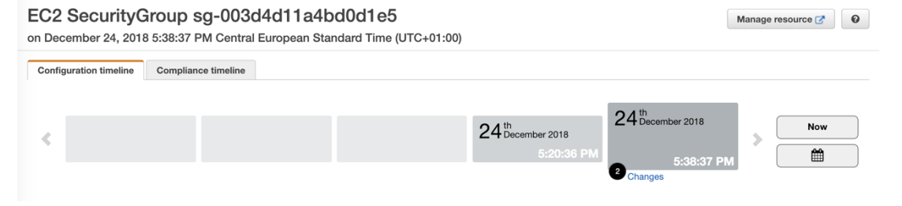

### **View Change Attribution (via CloudTrail API calls if enabled)**
You can view who made these **changes to the resources based on <u>CloudTrail</u>** if you have <u>enabled CloudTrail</u> in your accounts.

## **HANDS ON with Config**

### **Setting Up AWS Config**

- Click on **get started**

### **Initial Configuration**
1. Choose the type of resources you want to record
   
> **Important:** Config is **not a free service**, so if you enable it, you will have to pay

2. You can enable **recording for all resources** in the region, **including global resources**
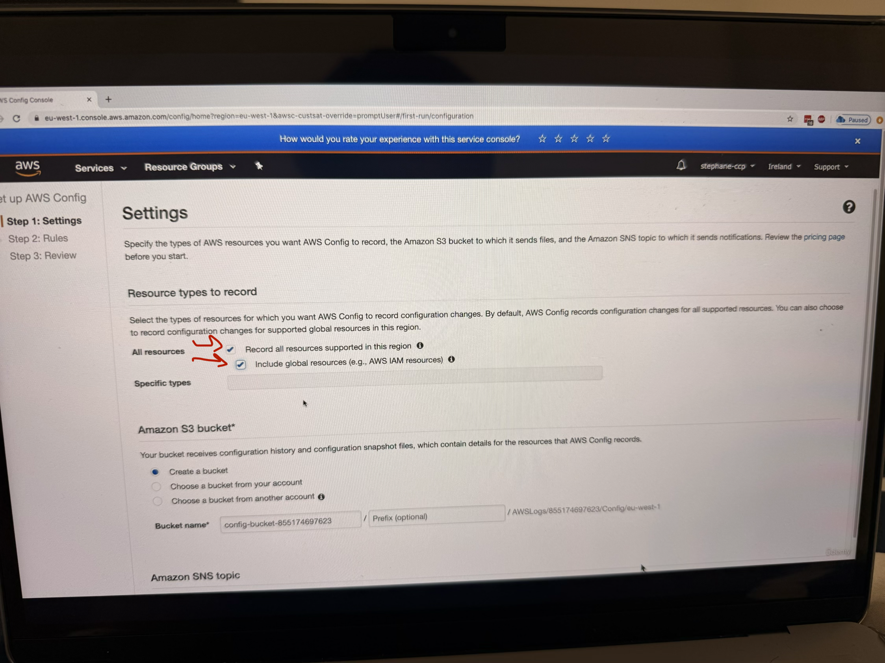
3. **Config** will create a **bucket** in which all the configuration will be stored (do not make changes, just keep the first option checked marked)
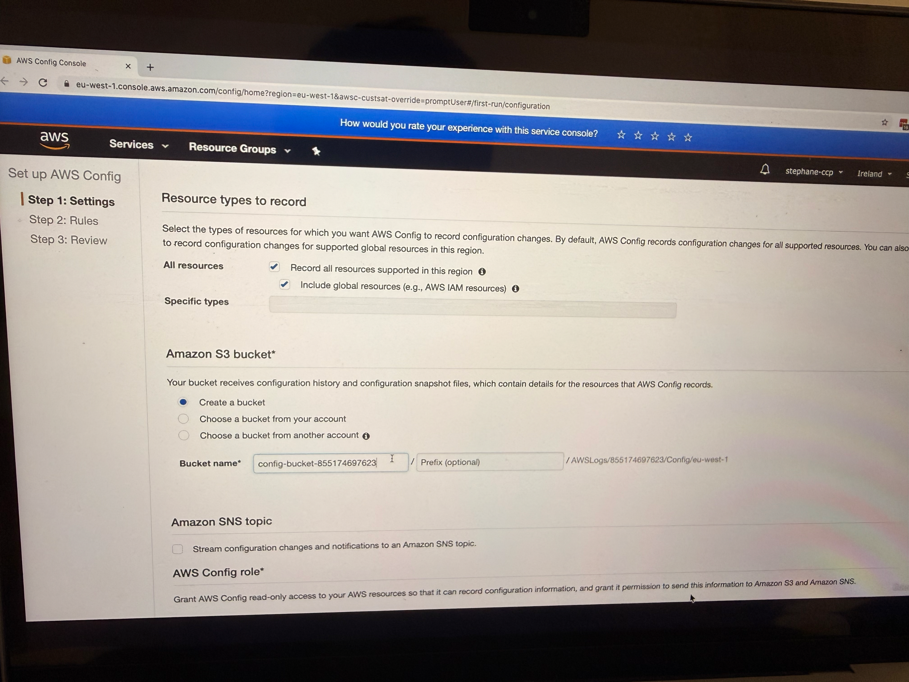

4. You can select a topic to send notifications for all configuration changes (this is for SNS)
    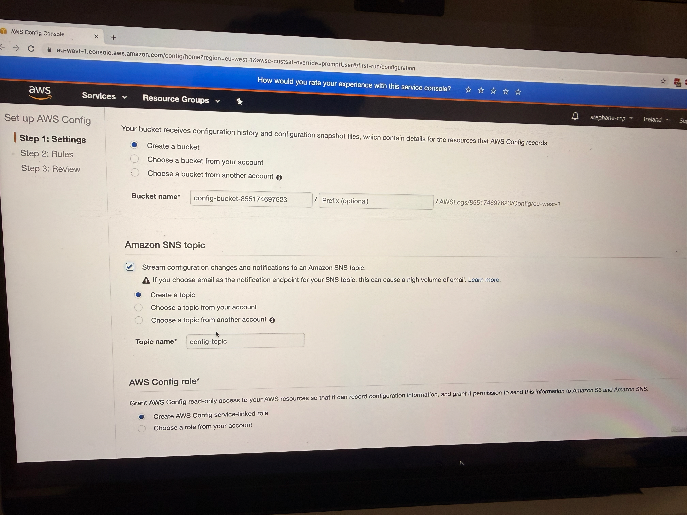
5. Config will create a service-linked role (recall IAM Roles, so it needs to create **service-linked role**)
   

### **Configuring Config Rules**
After clicking "Next," you can choose Config rules to apply to your account. These are compliance rules that will check your resources:

- **restricted-ssh**: This rule checks if SSH is open to everyone (this is for **EC2**)

- **public-entry-buckets**: Checks for buckets with public access
  - **rds-instance-public-access-check**: Validates RDS instance public access settings
  
- **s3-bucket-logging-enabled**: Ensures S3 bucket logging is enabled
- **s3-account-level-public-access-blocks**: Checks S3 account-level public access blocks

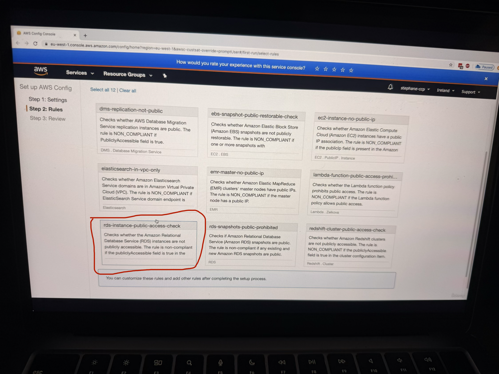

For the demonstration, the instructor enables the **restricted-ssh** rule to show compliance checking for security groups. After selecting the rule and clicking "Next," you can review the final configuration before confirming.

### **Configuration Review and Setup**
The final review shows that Config will:
- Record the configuration of all the resources
- Store the data in the S3 bucket
- Apply the selected Config rule (restricted-ssh in this case)

Click on **Confirm**

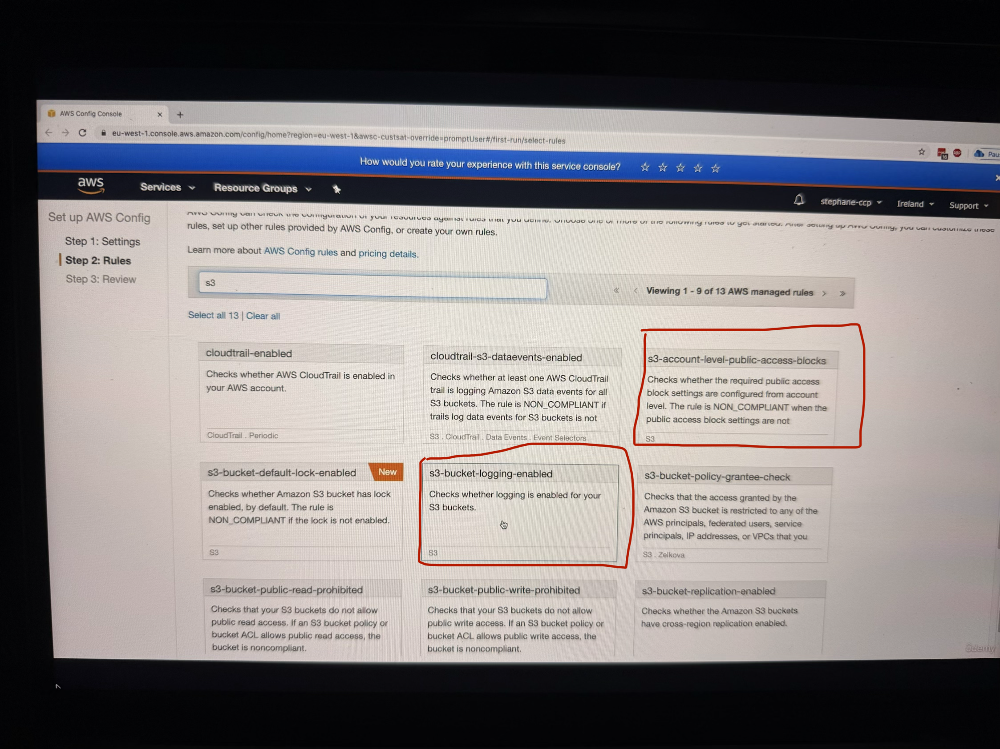
The instructor notes that setting up Config can take some time, so you need to wait for Config to complete the setup and record everything in your account. 

## **Working with the Config Console - New Console**

### **Resource Inventory Overview**
Once Config is set up, the instructor demonstrates using the **new console interface**. In the Config console, you can see a comprehensive inventory of all your resources in AWS. The instructor shows an example where you can see 5 security groups, 3 subnets, 1 Internet Gateway, and various other resources listed in the inventory as you can see in the image below, there are total 15 AWS resources.

So now when you look on RHS, there are some resources which are not compliant, see below image

### **Compliance Monitoring and Analysis**

The instructor demonstrates how to identify compliance issues. In the example shown, there is one rule that is not compliant - the **restricted-ssh rule**. When you click on this rule(see image below), you can:
- Look at the rule details
- See the resources in scope (see the 3rd image below)
- View that three out of five security groups are not compliant

(add 2 images together or showing step wise, one at 3:22 with red label on 1 non-complaint rule i.e. restricted SSH rule, 2nd image at 3:27)
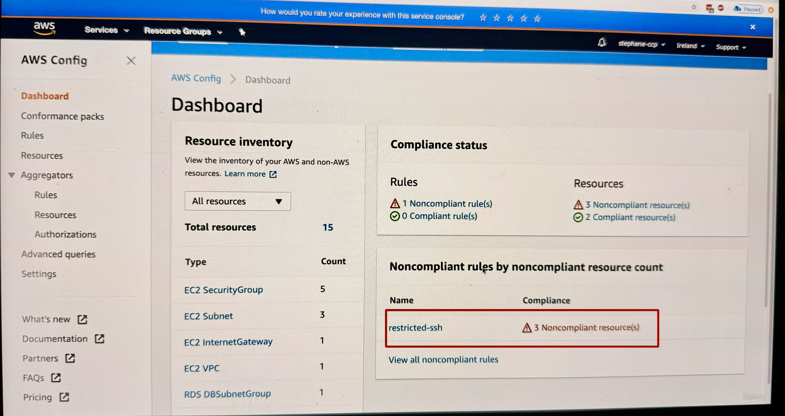
this image shows 1 non-complaint rule i.e. restricted SSH rule

This image shows resources in scope

Now as you see one of the security group is non-complaint, let us look at one of them by clicking on that specific security group

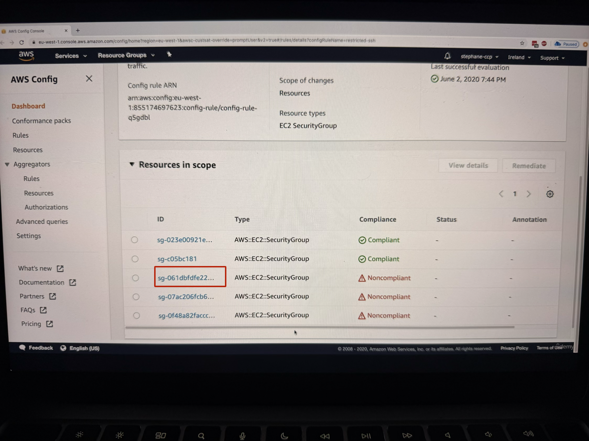

### **Deep Dive into Resource Analysis**
When you click on a specific security group that's not compliant, the instructor shows how you can:

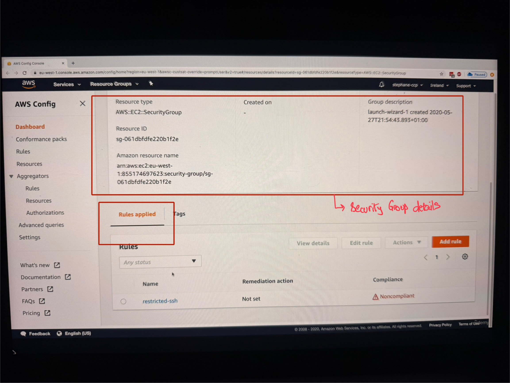

- Look at the details of the security group
- See that the rule is applied to this resource
- View that this rule is showing as not compliant
- Understand that the rule describes unrestricted SSH access being allowed on the security group (for this specifically we went to **definition of unrestricted SSH rule**, see the image below ==> `AWS Config>Rules>restricted-ssh`)

Now we want to fix the non-compliant rule correct, so we can do this using by going into **resource timeline** feature. For this go back to dashboard of AWS Config and on LHS navigation, click on **Resources** button

### **Resource Timeline Navigation**
The instructor demonstrates accessing the Resource Timeline feature:
1. Go to "Resources" in the navigation
2. Find and click on the non-compliant security group

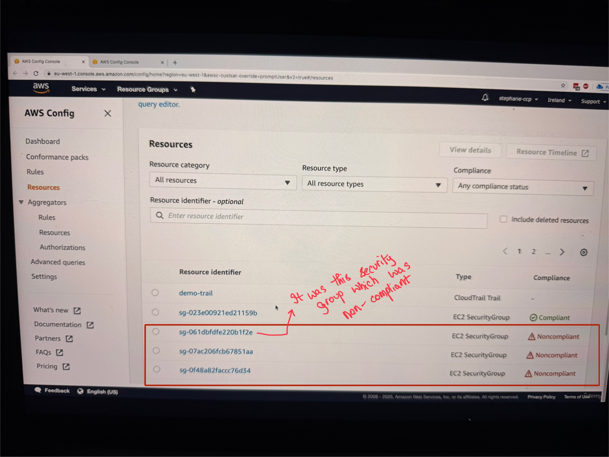
3. Click on "Resource Timeline"
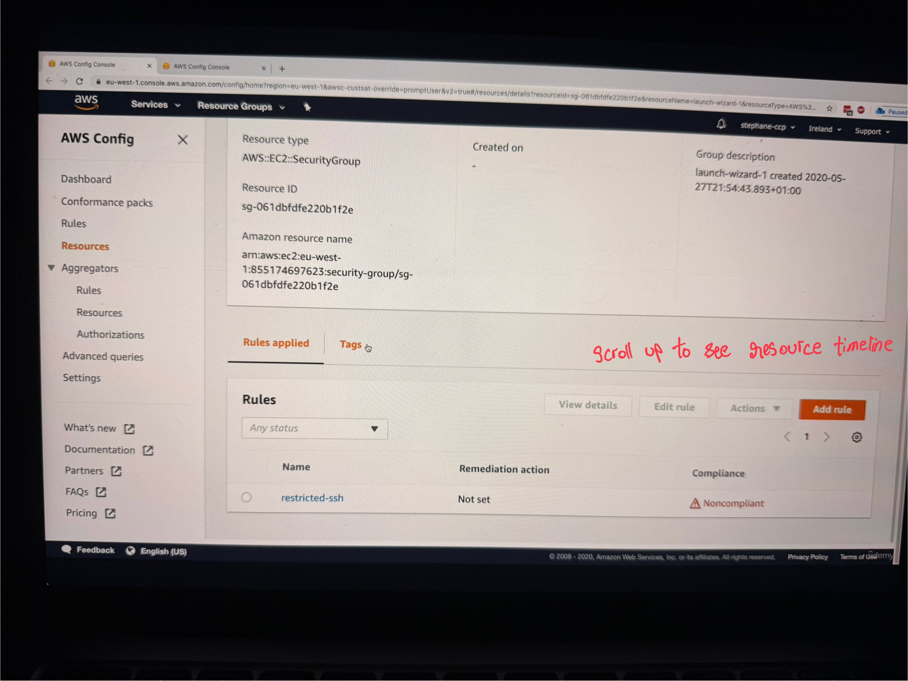
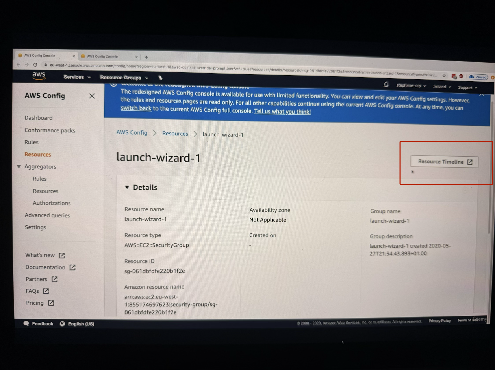

In the Resource Timeline, you can see:

- **Configuration Timeline**: Shows when configurations were made (the example shows configuration done on June 2nd)

- **Compliance Timeline**: Shows the current compliance status of your security group

- **Rule Details**: When you scroll down, you can see the rules and their compliance status, including details about why a resource is not compliant (such as having SSH port opened for everyone)

## **Hands-On Remediation Process**

### **Identifying and Fixing Non-Compliant Resources** (see the video, too many images)
The instructor provides a step-by-step walkthrough for fixing a non-compliant SSH security group rule:

1. **Navigate to the Problem**: From the Config console, identify the specific security group that needs attention
2. **Access EC2 Console**: Navigate to the EC2 console to make the necessary changes
3. **Locate Security Groups**: In the EC2 console, go to the left-hand side navigation and click on "Security Groups"
4. **Filter Resources**: Use the filter to find the specific security group you're looking for, then press Enter
5. **Review Inbound Rules**: Examine the inbound rules where you can see that SSH on port 22 is opened for everyone (0.0.0.0/0)
6. **Make Changes**: Delete or modify the problematic rule (the instructor demonstrates temporarily deleting the rule)
7. **Save Changes**: Save the rule changes to apply the fix

### **Re-evaluation and Monitoring** (see the video, too many images)
After making changes, the instructor shows two approaches for checking compliance:

**Automatic Re-evaluation**: You can wait for Config to automatically re-evaluate the resources, which happens periodically.

**Manual Re-evaluation**: For faster results, you can manually trigger re-evaluation:
1. Go to the specific rule in the Config console
2. Click on "Actions"
3. Select "Re-evaluate"
4. This will re-evaluate all noncompliant resources immediately

### **Tracking Results and Changes** (see the video, too many images)
The instructor demonstrates how to verify that your fixes worked:

1. **Refresh the Console**: After re-evaluation, refresh the Config console page
2. **Check Compliance Status**: You should see the number of noncompliant resources decrease (in the example, it went from three to two noncompliant resources)
3. **Resource Timeline Verification**: Go back to the Resource Timeline and refresh to see the updated status
4. **Visual Confirmation**: The resource should now show as green (compliant)

### **Detailed Change Tracking** (see the video, too many images)
When you click on "Changes" in the Resource Timeline, you can see:
- The Config rule status change from noncompliant to compliant
- Configuration changes by navigating to the "Configuration Timeline"
- Specific details about what changed (in the example, a rule that was previously configured was deleted)
- CloudTrail integration showing exactly who made the change (the root user removed the security ingress rule)
- A link to view the complete event details in CloudTrail for audit purposes

## **Key Benefits**

Config is very helpful to ensure that all the resources created by your employees within your company are compliant with whatever security rules you have decided upon. It provides comprehensive tracking of resource configuration and compliance over time.