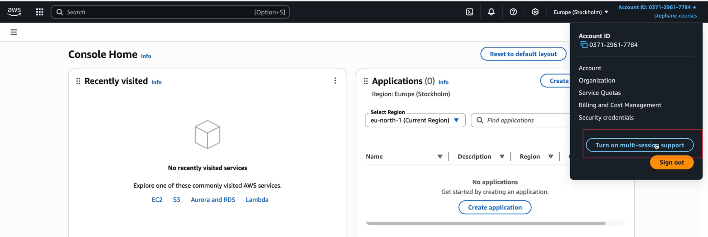
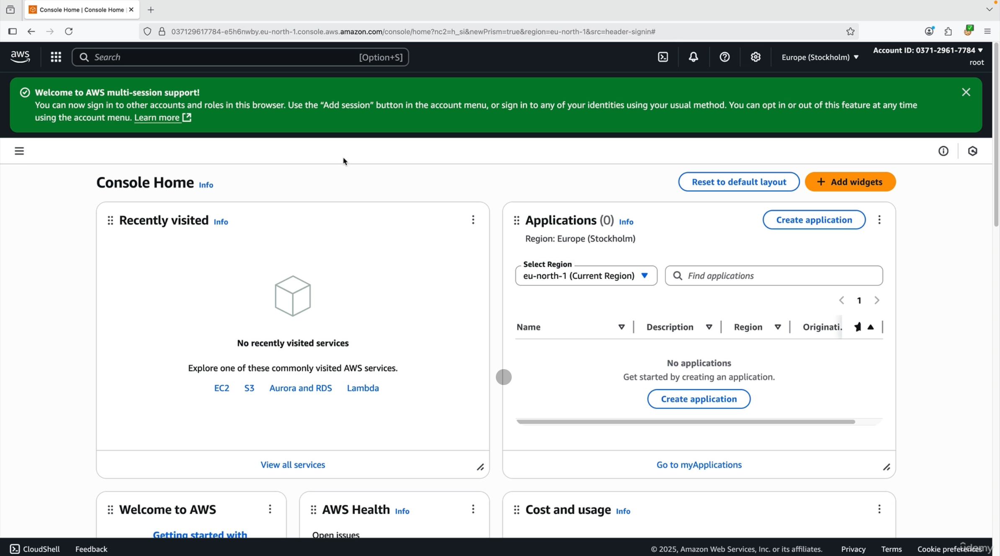
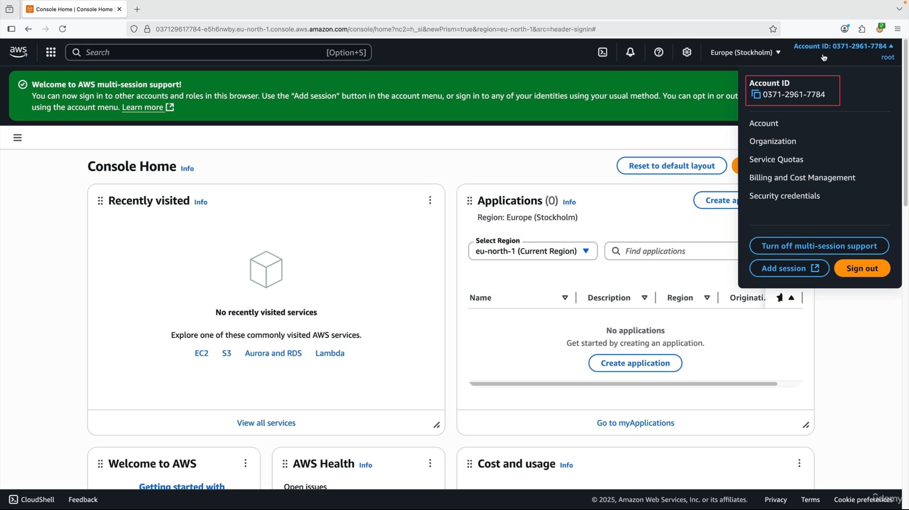
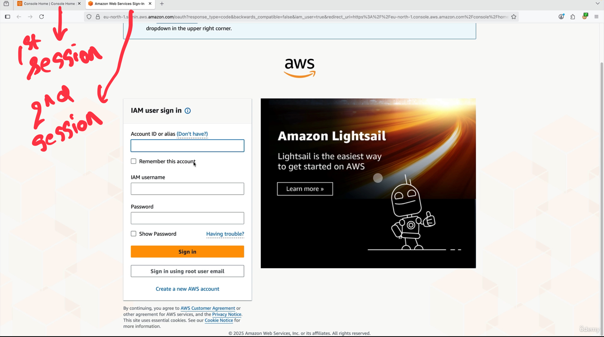
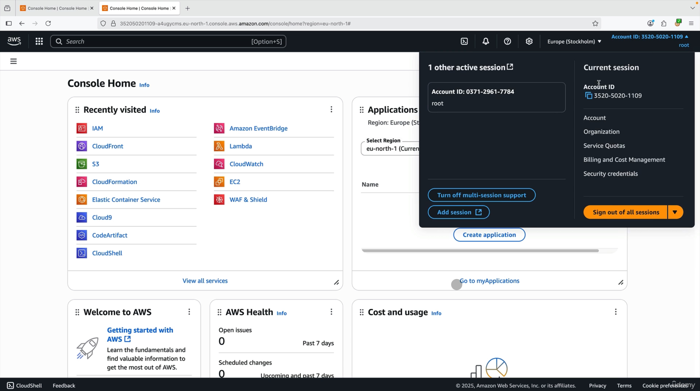

# AWS Multi-Session Support

Now that we have explored AWS IAM account management, it's time to discuss a very helpful feature that has been added to AWS - multi-session support. This feature allows you to have multiple AWS accounts open simultaneously in the same browser, which was not possible before and represents a significant improvement for users working with AWS at scale.

In this, when you login into AWS Account (root account), you can click on multi-session support (see image below):

when you click on it to turn it on:

So now I can add a session in the same browser with different account ids, see below:
1. Account ID: 0371-2961-7784

Now click on a button, to add a different session

2. Now if you see, you can login again using different Account ID or Root Account

3. Now you can see below that there are 2 different sessions created with different account id

For demonstration purpose, during the lecture, the instructor also demo that he created EC2 instance in the Account ID: 0371-2961-7784 and attached EBS volume to it and showed that in the 2nd Account ID (a different account), there was no EBS volume created...which tells that it is different AWS Account which has no connections with the first account ID. So with this you can use **AWS at a Scale** having multiple Accounts on **same browser**.