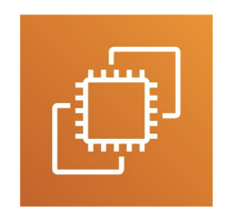

    <!-- Entire HTML from Google Docs goes here -->
    <html><head><meta content="text/html; charset=UTF-8" http-equiv="content-type"></head><body class="c20 doc-content"><h1 class="c7">Amazon EC2</h1>
Next, we will move on to EC2, where we will create our first website on AWS.
<h3 class="c7">What is Amazon EC2?</h3>
EC2 is one of the most popular AWS offerings and is used everywhere. It stands for Elastic Compute Cloud, and it is the way to do Infrastructure as a Service (IaaS)&nbsp;on AWS.

EC2 is not just one service; it is composed of many things at a high level. Knowing how to use EC2 is fundamental to understanding how the cloud works, as the cloud is the ability to rent compute whenever you need it on demand.

At its core, EC2 allows you to:
<ul class="c2 lst-kix_list_1-0 start"><li class="c7 c11 li-bullet-0">Rent virtual machines, which are called EC2 instances.</li><li class="c5 c11 li-bullet-0">Store data on virtual drives, or EBS volumes.</li><li class="c5 c11 li-bullet-0">Distribute load across machines with an Elastic Load Balancer.</li><li class="c5 c11 li-bullet-0">Scale services using an Auto Scaling Group (ASG).</li></ul><h3 class="c5">Configuring Your EC2 Instances</h3>
When you rent virtual servers from AWS, you have lots and lots of options to choose from. At its core, you can choose pretty much how you want your virtual machine to be and rent it from AWS. That is the power of the cloud&mdash;you can do this in the blink of an eye.

Here are the things you can configure for your EC2 instances:
<ol class="c2 lst-kix_list_2-0 start" start="1"><li class="c7 c12 li-bullet-0">Operating System:&nbsp;You have three options to choose from.</li></ol><ul class="c2 lst-kix_list_3-1 start"><li class="c7 c8 li-bullet-0">Linux (the most popular)</li><li class="c0 li-bullet-0">Windows</li><li class="c0 li-bullet-0">Mac OS</li></ul><ol class="c2 lst-kix_list_2-0" start="2"><li class="c5 c12 li-bullet-0">Compute &amp; Memory:</li></ol><ul class="c2 lst-kix_list_4-1 start"><li class="c7 c8 li-bullet-0">How much compute power and cores (CPU).</li><li class="c0 li-bullet-0">How much Random Access Memory (RAM).</li></ul><ol class="c2 lst-kix_list_2-0" start="3"><li class="c5 c12 li-bullet-0">Storage Space:</li></ol><ul class="c2 lst-kix_list_5-1 start"><li class="c7 c8 li-bullet-0">Storage attached through the network (EBS or EFS).</li><li class="c0 li-bullet-0">Hardware-attached storage (EC2 Instance Store).</li></ul><ol class="c2 lst-kix_list_2-0" start="4"><li class="c5 c12 li-bullet-0">Networking:</li></ol><ul class="c2 lst-kix_list_6-1 start"><li class="c7 c8 li-bullet-0">The type of network card you want to attach (e.g., a fast one).</li><li class="c0 li-bullet-0">The kind of public IP address you want.</li></ul><ol class="c2 lst-kix_list_2-0" start="5"><li class="c5 c12 li-bullet-0">Firewall Rules:&nbsp;You need to handle the firewall rules for the instance, which is done through a Security Group.</li><li class="c5 c12 li-bullet-0">Bootstrap Script:&nbsp;You can use a script to configure the instance at first launch, which is called EC2 User Data.</li></ol><h3 class="c5">Bootstrapping with EC2 User Data</h3>
It is possible to bootstrap our instances using an EC2 User Data script. Bootstrapping&nbsp;means launching commands&nbsp;when the machine starts. This script is only run once&nbsp;when the instance first starts&nbsp;and will never be run again.
<ul class="c2 lst-kix_list_7-0 start"><li class="c7 c11 li-bullet-0">Purpose:&nbsp;The specific purpose of EC2 User Data is to automate boot tasks.</li><li class="c5 c11 li-bullet-0">Common Tasks:&nbsp;These are tasks you usually want to automate when you boot your instance.</li></ul><ul class="c2 lst-kix_list_8-1 start"><li class="c7 c13 li-bullet-0">Installing updates</li><li class="c5 c13 li-bullet-0">Installing software</li><li class="c5 c13 li-bullet-0">Downloading common files from the internet</li><li class="c5 c13 li-bullet-0">Anything else you can think of</li></ul><ul class="c2 lst-kix_list_7-0"><li class="c5 c11 li-bullet-0">Permissions:&nbsp;The EC2 User Data script runs with the root user, so any command you have will have sudo rights.</li></ul>
Just know that the more you add to your user data script, the more your instance has to do at boot time.

</body></html>

