# AWS IAM Roles - Creating an EC2 Role (Tutorial Notes)

## **What We'll Accomplish**
In this hands-on practice, we're going to learn how to create IAM roles in AWS, specifically focusing on creating a role for an EC2 instance. A role is a way to give AWS entities permissions to do stuff on AWS. This is a very common thing to know in AWS, which is why we're learning about it. We'll create the role now and use it later when we get to the EC2 section.

## **Understanding AWS IAM Roles**
Before we begin, it's important to understand that roles are different from users. Roles are designed to be assumed by AWS services (like EC2 instances) rather than by individual people. When we create a role for EC2, we're essentially saying "any EC2 instance that assumes this role will have these specific permissions."

## **Step-by-Step Procedure**

### **1. Navigate to Roles in IAM Console**
On the left-hand side of the IAM console, click on "Roles". 

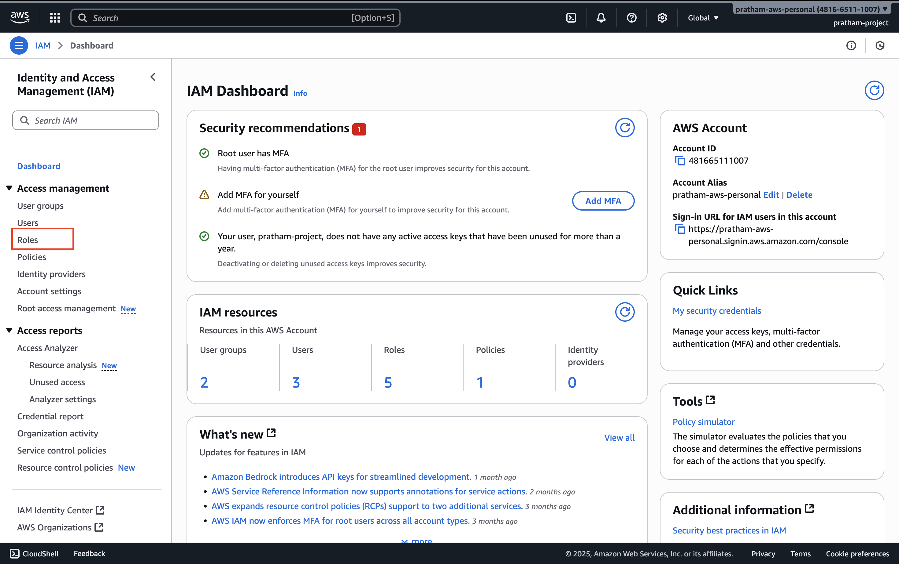

**What you'll see**: Some roles may have already been created for your account - could be two, could be more. It doesn't matter how many are there already.

**What we're doing**: We're going to create our own role from scratch to understand the process.

### **2. Initiate Role Creation**
Click the button to create a new role.

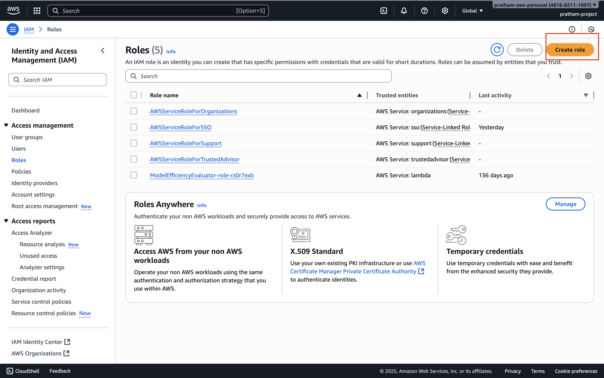

**Understanding role types**: You'll see that you can create different kinds of roles - actually five different types. However, the one that you need to know about for this hands-on and for the exam is going to be a role for an AWS service.

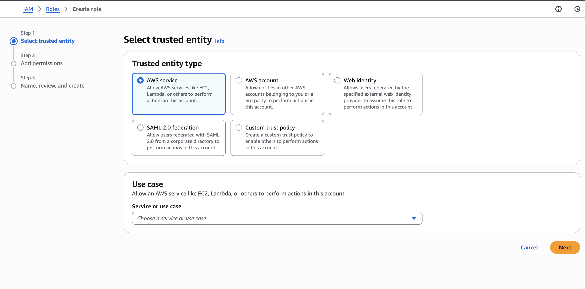

### **3. Select Role Type**
Choose "AWS service" as the type of role you want to create.

**Why this matters**: This selection determines what entity will be able to assume (use) this role. Since we want EC2 instances to use this role, we select AWS service.

### **4. Choose the Service**
Now we need to choose for which service we want this role to apply to.

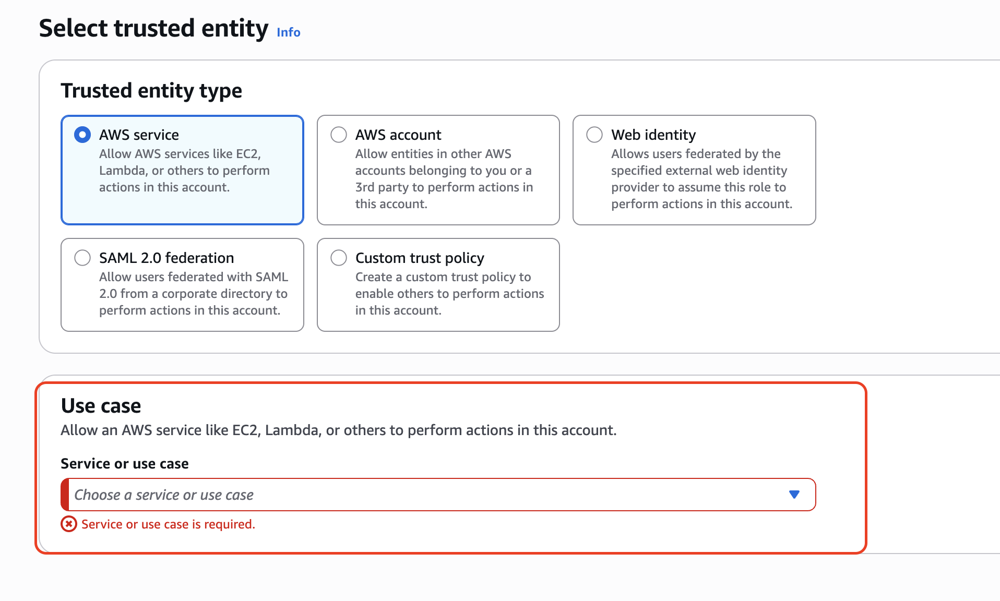
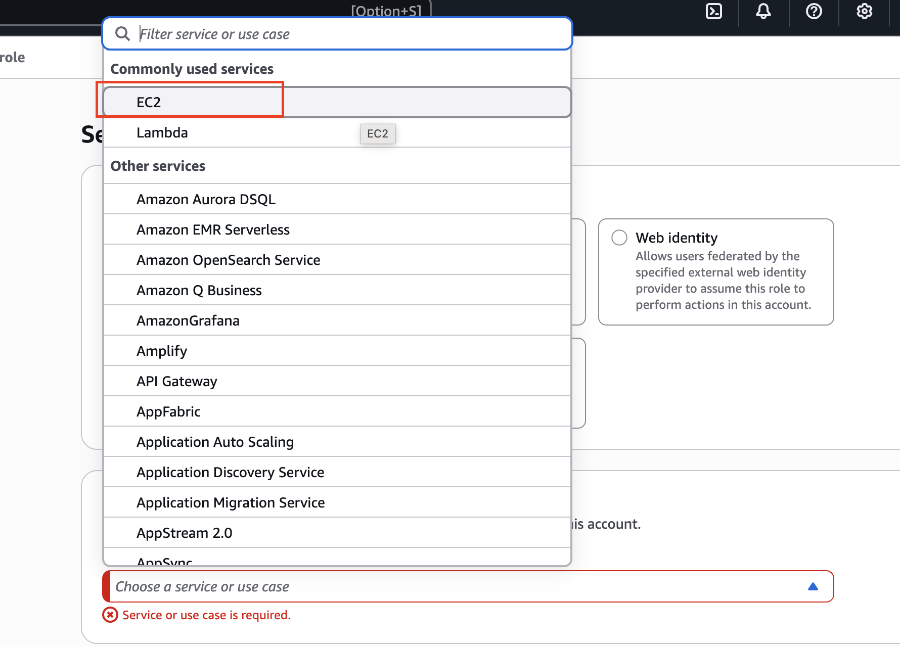

**What you'll see**: If you click on the dropdown, you have commonly used services such as EC2 and Lambda, or a role for pretty much every service on AWS.

**For our tutorial**: We are going to create a role for an **EC2 instance** since we'll need it when we get to the EC2 section.

1. Choose "EC2" from the service list
2. The use case should just be "EC2" - disregard any other specialized use cases

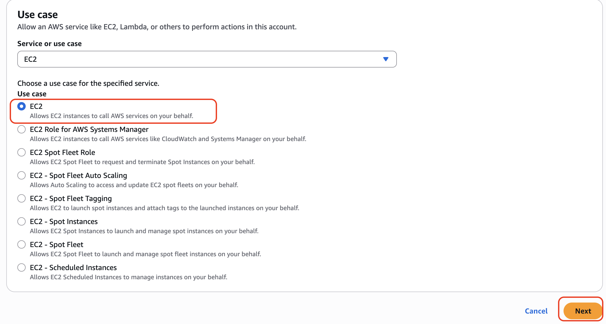

**Key Learning**: This step establishes which AWS service will be trusted to assume this role. By selecting EC2, we're saying only <u>EC2 instances can use this role.</u>

### **5. Attach Permissions Policy**
Click "Next" to proceed to the permissions step.

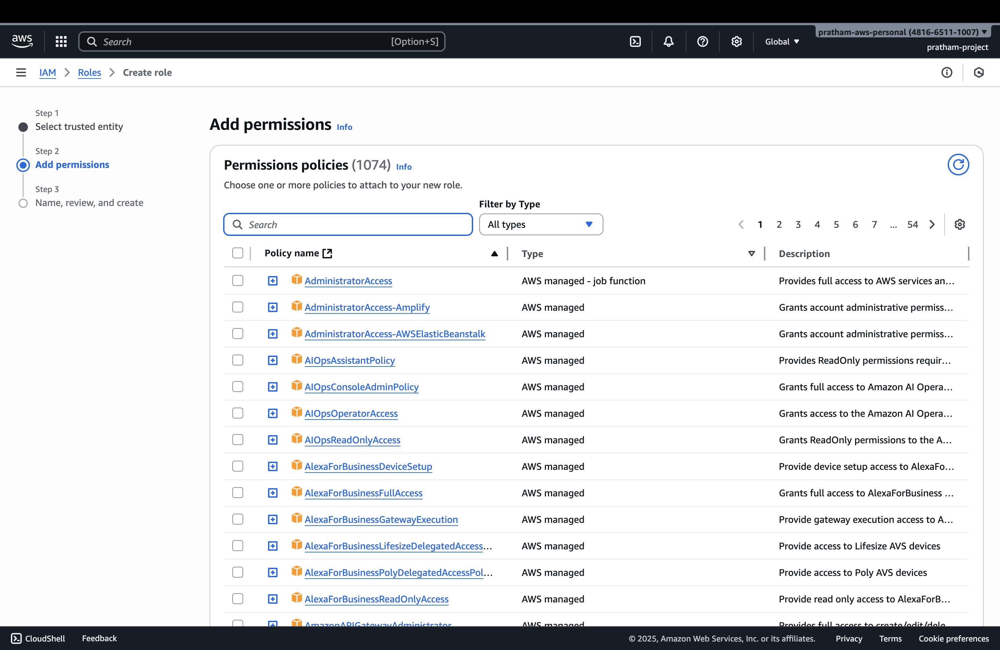

Now that we've created a role for an EC2 instance, we need to attach a policy that defines what permissions this role will have.

**For this example**: We're going to attach the "IAM Read Only Access" policy to allow our EC2 instance to read whatever is in IAM.

1. Search for "IAM Read Only Access" in the policy search box
2. Select the checkbox next to the policy
3. Click "Next"

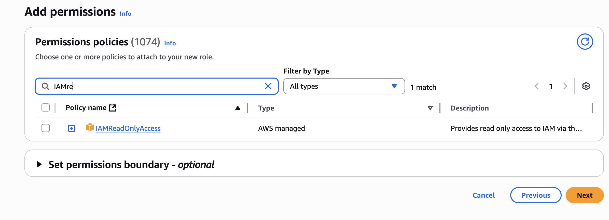

**Teaching point**: The policy you attach determines exactly what the entity assuming this role will be able to do. In this case, read-only access to IAM means the EC2 instance can view IAM resources but cannot modify them.

### **6. Configure Role Details**
Now we need to enter the role name and review our configuration.

**Role Name**: Enter a descriptive name - for example: `DemoRoleForEC2`

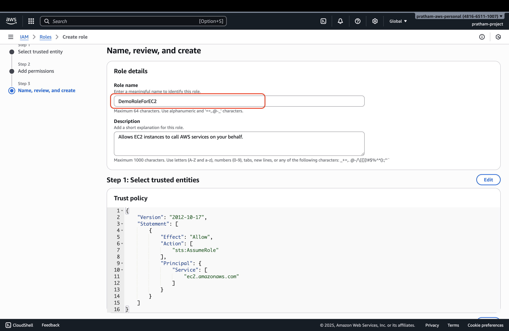

**What you'll see during review**:
- **Trusted entities**: This shows that this role can be assumed by the EC2 service. This is what defines it as a role for Amazon EC2.

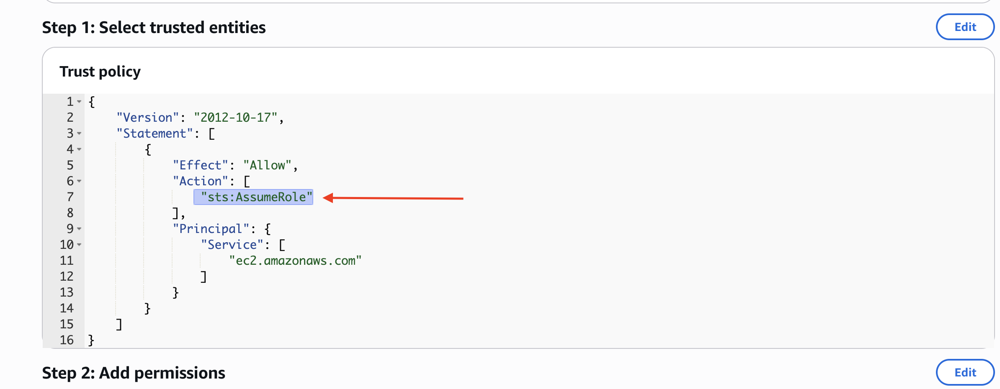

- **Permissions**: Verify that it has IAM Read Only Access attached
- **Role name**: Confirm your role name is correct

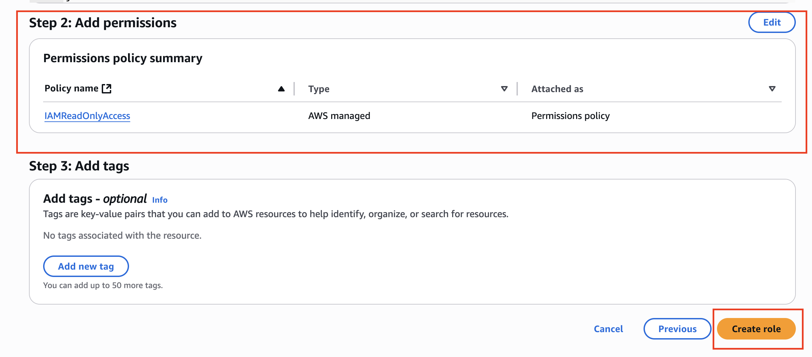

### **7. Create the Role**
Click "Create role" to finalize the creation.

**Confirmation**: Your role is now created and will appear in your roles list.

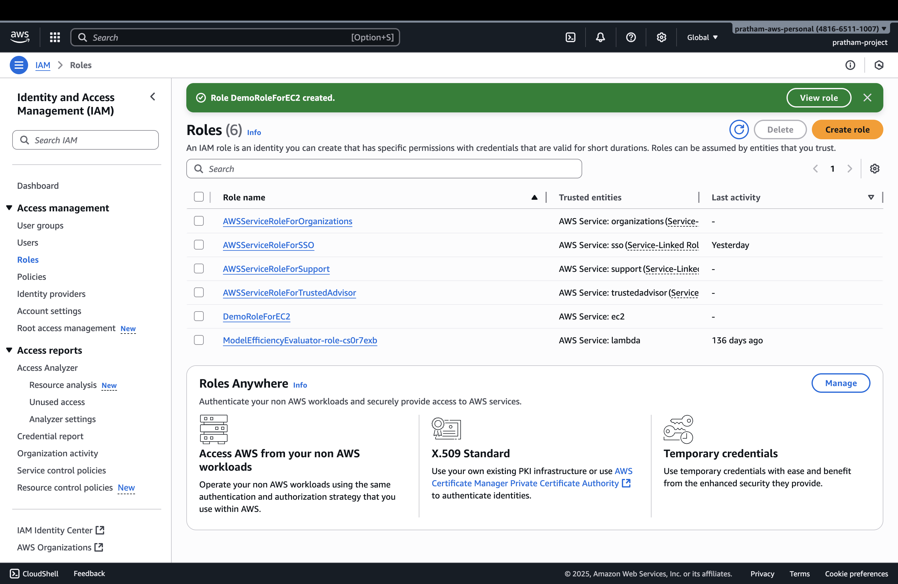

### **8. Verify Role Creation**
You can click on the newly created role to verify that the permissions are correct.

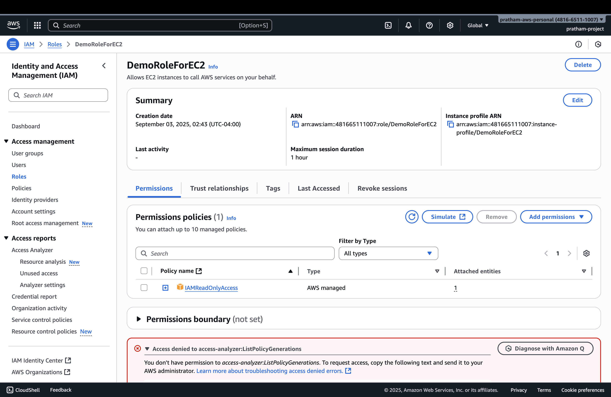

**What this demonstrates**: The role now exists with the proper permissions and trust relationships configured.

## **Important Notes**

> **Note**: We cannot use this role just yet because we need to get to the EC2 section first. We will use it when we get to that part of the course.

> **Key Takeaway**: You've now seen how to create a role for Amazon EC2 and how to attach correct permissions to it. This process - creating roles for AWS services and attaching appropriate policies - is a fundamental skill in AWS administration.

## **What We've Learned**

1. **Roles vs Users**: Roles are designed for AWS services to assume, not for human users
2. **Service-specific roles**: Different AWS services can have roles created specifically for them
3. **Trust relationships**: The service selection determines which AWS service can assume the role
4. **Permission attachment**: Policies attached to roles determine what actions can be performed
5. **Practical application**: This EC2 role will be used in upcoming EC2 hands-on exercises

## **Next Steps**
This role is now ready to be attached to EC2 instances when we reach the EC2 section of the course. The hands-on practice there will demonstrate how EC2 instances can assume this role and use the IAM Read Only Access permissions we've configured.