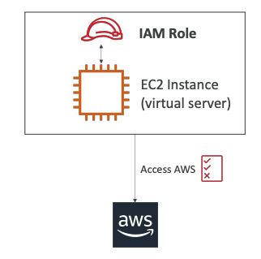

# IAM Roles

Now that we have covered users and groups, we need to talk about the last component of IAM, which is called **IAM Roles**.

## What are IAM Roles?

- Some AWS services that we'll be launching throughout this course will need to perform actions on our behalf, on our account. 
- For these services to perform these actions, they're just like users - they will need some kind of permissions. 
- We need to assign permissions to AWS services, and to do so, we're going to create what's called an **IAM Role**.

These IAM roles will be just like a user, but they are intended to be used not by <u>physical people</u>, but instead they will be used by **AWS services**.

## How IAM Roles Work

Here's how it works with a practical example:

We are going to create throughout this course an **EC2 Instance**. An EC2 Instance is just like a virtual server, and we'll see this in the next section. This EC2 Instance may want to perform some actions on AWS, and to do so, we need to give permissions to our EC2 Instance. So in this process we need to create an **IAM Role** (see the image below)

**The Process:** (see the image below)
1. We create an IAM Role
2. We assign it to our EC2 Instance 
3. Together, they make one entity
4. When the EC2 Instance tries to access some information from AWS, it will use the IAM Role
5. If the permissions assigned to the IAM Role are correct, then we're going to get access to the call we're trying to make (that is access to the AWS)

## Common Role Examples

Some common roles include:

• **EC2 Instance Roles** - As shown in the example above
• **Lambda Function Roles** - For AWS Lambda functions
• **CloudFormation Roles** - For AWS CloudFormation services

And other services that perform actions against AWS that we'll see throughout this course.

---

*Note: This is a high-level overview. In the next lecture we'll be creating a role, but we won't be using it yet until the next section.*