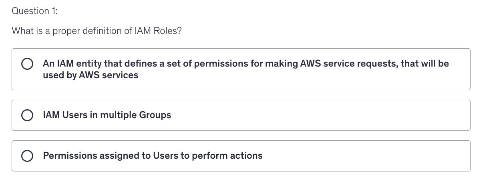
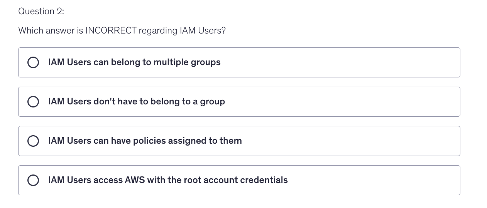
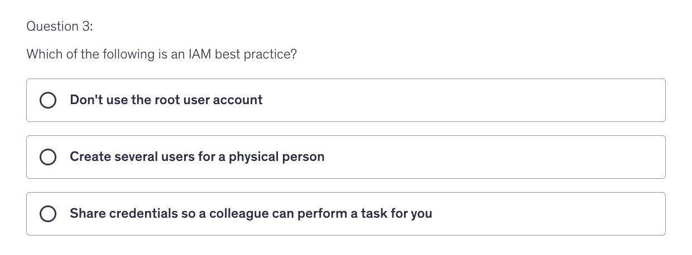
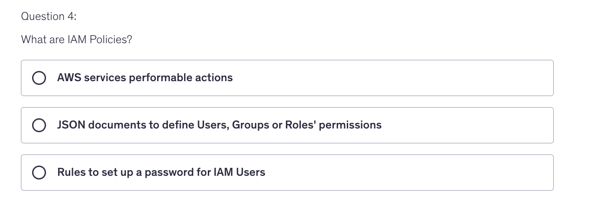
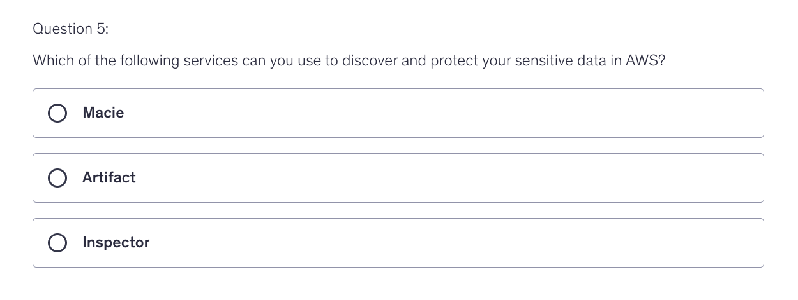
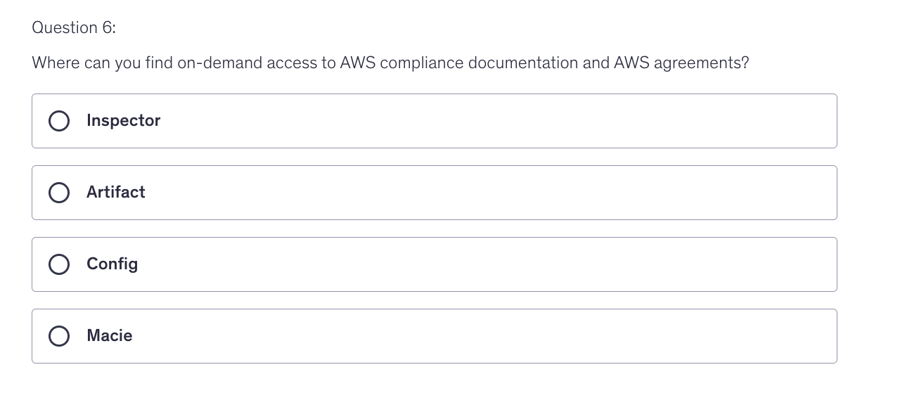
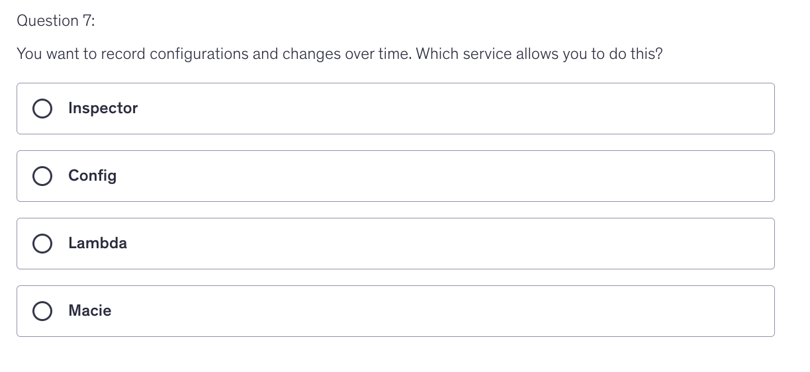

# Quiz 

 
Answer

 Answer is Option 1

 
Answer

 Answer is Option 4

 
Answer

 Answer is Option 1

 
Answer

 Answer is Option 2

 
Answer

 Answer is Option 1

 
Answer

 Answer is Option 2

 
Answer

 Answer is Option 2

