# Amazon S3 - Hands On

In this guide, we will walk through the process of creating a new Amazon S3 bucket, configuring its basic settings, uploading files (objects), and understanding the fundamental concepts of object access. We will also cover how to organize objects using folders and how to properly delete them, all while following the verbose, step-by-step instructions from the original lesson.

### Prerequisites

- An AWS account with access to the Amazon S3 console.

- The following files saved to your local computer for uploading:
  
  - `coffee.jpg`, here is the [link](https://plus.unsplash.com/premium_photo-1674327105076-36c4419864cf?fm=jpg&q=60&w=3000&ixlib=rb-4.1.0&ixid=M3wxMjA3fDB8MHxzZWFyY2h8MXx8YWVzdGhldGljJTIwY29mZmVlfGVufDB8fDB8fHww) to download
  
  - `beach.jpg`, here is the [link](https://www.google.com/imgres?q=beach%20images&imgurl=https%3A%2F%2Fstatic.vecteezy.com%2Fsystem%2Fresources%2Fthumbnails%2F054%2F311%2F652%2Flarge%2Ftranquil-tropical-paradise-scene-starfish-and-seashells-rest-on-a-white-sandy-beach-with-sea-gentle-turquoise-waves-summer-background-copy-space-for-your-text-video.jpg&imgrefurl=https%3A%2F%2Fwww.vecteezy.com%2Ffree-videos%2Fsummer-beach-background&docid=jDDhRF8yQG5zKM&tbnid=qgtnhUmalmYTcM&vet=12ahUKEwjf6IDhjvqPAxX1j4kEHdD3FWMQM3oECBkQAA..i&w=800&h=450&hcb=2&ved=2ahUKEwjf6IDhjvqPAxX1j4kEHdD3FWMQM3oECBkQAA) to download

### **1. Create an S3 Bucket**

Here I am in Amazon S3, and I'm going to go ahead and create a bucket.

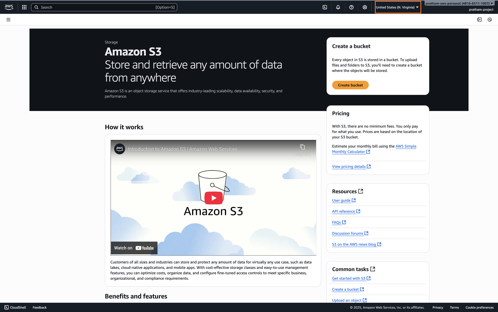

1. Select a Region
   
   You will notice here that there's a region selected, which is `US (N Virginia)`. This is because I have the region selection in here. Choose the region you want to create your bucket in. We'll see that Amazon S3 still has a view over all your buckets across all regions.

2. Choose a Bucket Type
   
   Now, there's a bucket type that you may or may not see. If you're in some regions where it's available, you will see "General purpose" or "Directory new." Over time, it will be in more regions.
   
   > **Note:** If you don't see this in your region, this is fine. The option you should choose if you see it is "General purpose." If you don't see this option, it will be automatically "General purpose." So don't touch anything and don't feel alarmed if you don't see these options. Directory buckets are for a specific type of use case that is not covered at the exam, so I will not be talking about it.
   > 
   > So, if you see the screen, choose "General purpose." If you don't see the screen, everything is fine, do not worry.

3. Choose a Bucket Name
   
   Next, you need to choose a bucket name.
   
   > Key Concept: Bucket Name Uniqueness
   > 
   > If you enter a bucket name that is already taken, for example, **"tests,"** and you try all the way down to create your bucket, you're going to get an error saying that the bucket with the same name already exists. Your **bucket name must be unique across all regions and all accounts ever created in AWS.**
   > 
   > This is why I name my buckets with something very, very personal. For example, it could be `pratham-demo-s3`, and I usually add a version number, `v5`, because I've been creating this video many, many times over as the interface changes.
   
   Enter a **unique bucket name**, such as `pratham-s3-demo-v2`. This should be **available** and **should have no errors**. But <u>if someone already took it, then I will need to change the name</u>.
   
   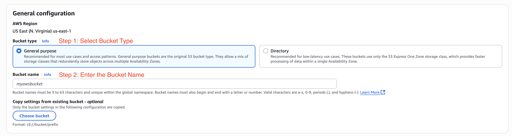

4. **Configure Initial Settings**
   
   We will leave most of the settings as their secure defaults.
   
   - **Object Ownership:** Right now you have "ACLs disabled." This is recommended. This is a security setting. Don't worry about it. We'll leave it as the default.
   
   - **Block public access for this bucket:** Again, we'll leave this enabled. So we'll "Block all public access," and we want to have maximum security in our bucket so only we can upload files to it.
   
   - **Bucket Versioning:** We want to "Disable" bucket versioning right now, and we'll see later on how to enable it.
   
   - **Tags:** No tags are needed.
   
   - **Default encryption:** I'm going to use "Server-side encryption with Amazon S3 managed keys (SSE-S3)." So all my objects are going to be encrypted, and I will choose the first option. We'll talk about encryption later on. For "Bucket Key," I will "Enable" it.
   
   As you can see, we'll leave all the settings as default. The only thing we have set, really, is the bucket name.

5. **Create the Bucket**
   
   Scroll to the bottom of the page and click the "Create bucket" button. It has now been successfully created.
   
   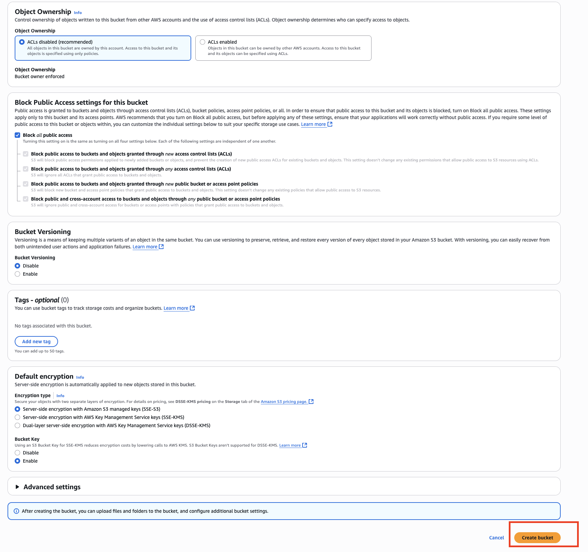

### **2. Viewing and Finding Your Buckets**

You will see here in this UI all your buckets. If you have "Directory" enabled, you will also see directory buckets; right now I have none. But your "General purpose" buckets are here.

> **Note:** Right now, you should see one bucket if you just started this course. For me, I have 33 because I've been using my account quite a lot. This will display buckets for all AWS regions, not just the one you're in right now, but all regions. As you can see, I have Ireland, London. If I scroll down, I get us-east-1, Frankfurt, and so on.

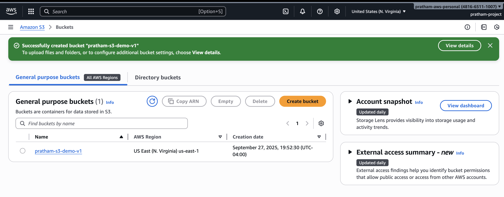

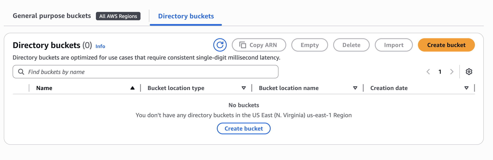

All your buckets are going to be displayed here, and you can do a little search. For example, search for pratham-demo. Here is my bucket.

### **3. Uploading Objects to Your Bucket**

1. Click on your new bucket to have a look at it inside. Now in my bucket, I would like to start uploading objects because currently you have zero objects.
   
   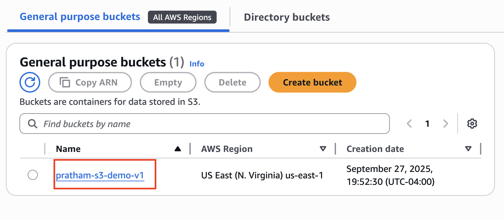

2. Click "Upload," and then we can "Add files."
   
   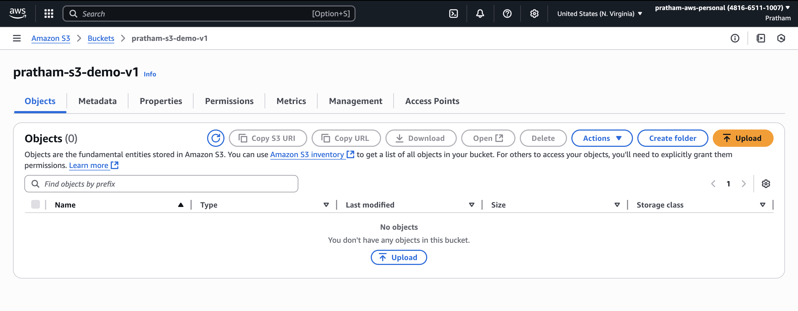

3. Navigate into your code, go into the S3 folder, and then you will find a `coffee.jpg `file. Choose this coffee.jpg file. As you can see, it's an image jpg, it has 100 kilobytes in size, and the destination is `s3://pratham-demo...` which is my bucket.
   
   [SCREENSHOT: The S3 upload screen showing the coffee.jpg file staged for upload with its details.]
   
   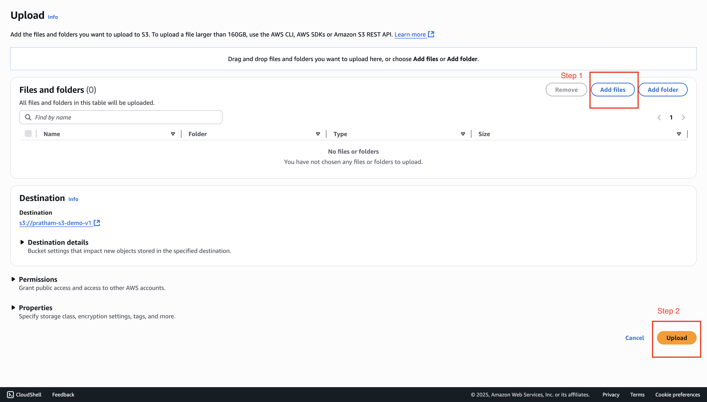

4. Click the "Upload" button. We're done.

5. You can close the upload status panel on the right-hand side. Back in my S3 bucket, I can see the `coffee.jpg` file is under my "Objects."

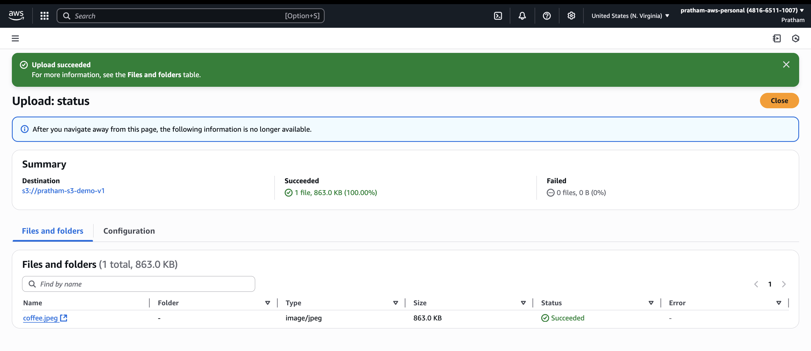

### **4. Understanding Object Access**

Now that we have an object, let's explore how to access it.

1. Click on the `coffee.jpg` object to see more details about that file.
   
   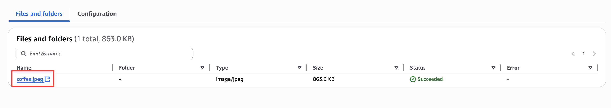

2. Now that we are in the object page, we can have a look at a bunch of properties:
   
   1. when it was uploaded, 
   
   2. the size, 
   
   3. the type, and 
   
   4. there's an `"Object URL"` here. 
   
   We'll be playing with it in a moment.
   
   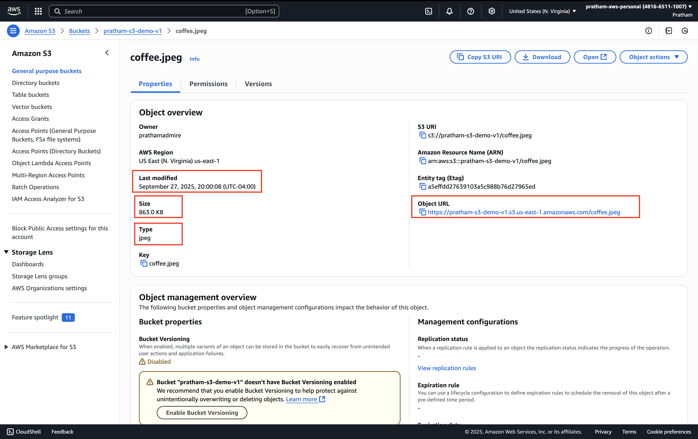

3. Now we want to open this object and see if we can view it. I'm going to click on `"Open"` in the top right. If I do click on `"Open,"` as you can see, I can see my `coffee.jpg` file. So this is the one I have uploaded, and it is on the internet. Awesome, right?
   
   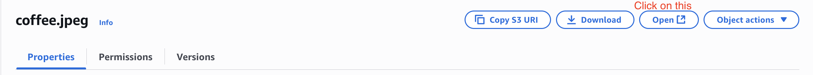
   
   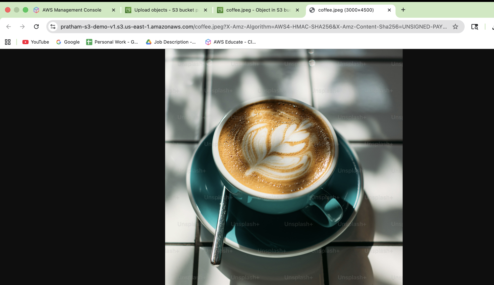

4. Now, go back to the object overview page and click on the "Object URL" to copy it. Paste it into a new browser tab and press Enter. As you can see, I get an "Access denied" error.
   
   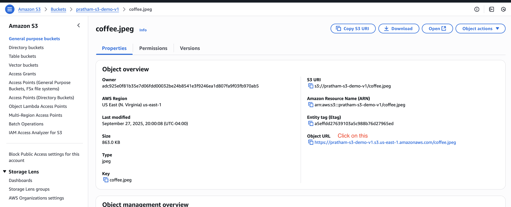
   
   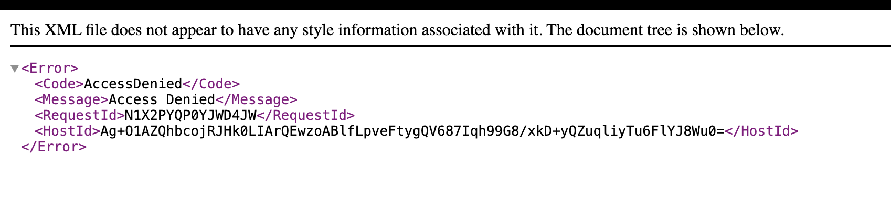

> ### **Key Learning: Pre-signed URL vs. Public URL**
> 
> So, what's the difference? This public URL is not working, but the URL from the "Open" button is working.
> 
> Well, the URL from the "Open" button, if you have a look at it, the beginning is exactly the same, but then the rest is a very, very complicated and long URL. This is because it's called an **S3 Pre-signed URL**.
> 
> This URL actually contains a signature that verifies that I am the one making the request, and therefore it has my credentials in it. Because my credentials are encoded in this URL, Amazon S3 says, "Well, Pratham is allowed to view his own object, therefore I will display it."
> 
> The public URL does not work, but this pre-signed URL with my own credentials works. Of course, this URL is only for me. We'll see how to make that object public later on so that the public URL will function as well.

### **5. Working with Folders**

Let's go back into our bucket, `pratham-demo-s3`.

1. I have one object, but I can create a folder. Click "Create folder."
   
   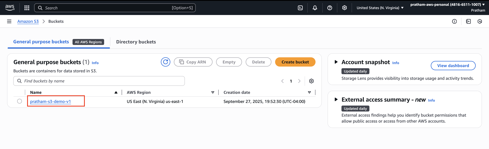
   
   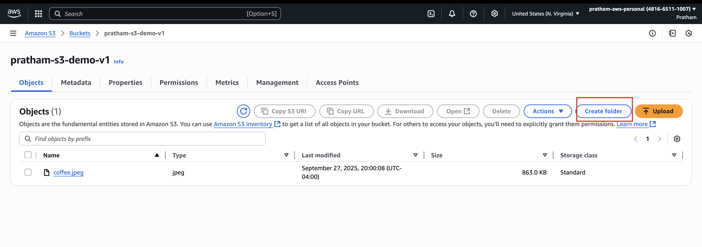

2. For the folder name, enter `images`. Scroll down and create this folder.

3. Now I have the `images` folder in my bucket. I can click on it, and within it, I can upload again a file.

4. Click "Upload" and then "Add files." This time, I will upload the `beach.jpg` file. As you can see, the destination is my `images` folder within my S3 bucket.

5. Click "Upload" and then close the status panel.

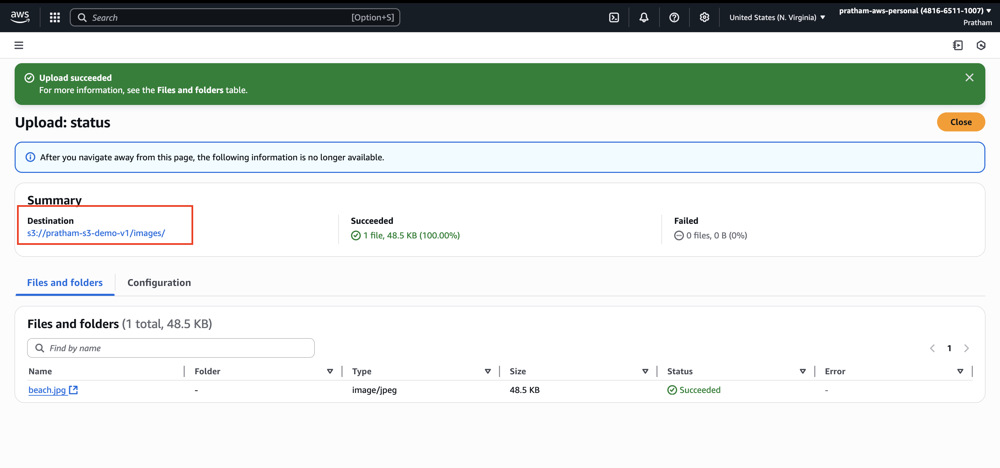

As we can see now, we have the `beach.jpg` object within the `images` folder. If I go one level up, we can see the folder here. This looks just like the cloud storage service you're used to, such as **Google Drive** or **Dropbox**. Here, we have something very similar in terms of the user experience on Amazon S3.

### **6. Deleting Folders and Objects**

1. Navigate into the `images` folder.

2. Select the folder by clicking the checkbox next to it, and then click the "Delete" button. This will delete everything within the folder.

3. To delete things, AWS will ask you to type permanently delete into the text input to confirm.
   
   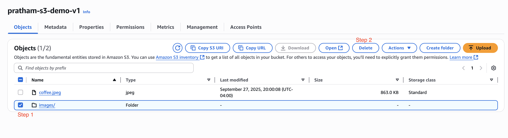

4. Click the "Delete objects" button, and I'm good to go.

That's it for this lecture. We've seen how we can upload objects into Amazon S3, how we can open them in two different ways, create folders, delete folders, and so on.