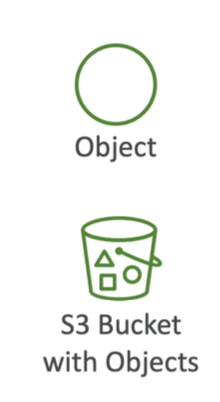

# **Amazon S3 Overview**

- This section is very important because **Amazon S3** is one of the **main building blocks of AWS**.
  
- Amazon S3 is advertised as **infinitely scaling storage**.
  
- A lot of the **web relies on Amazon S3**.
  
- Many websites use S3 as a backbone.
  
- Many AWS services also use Amazon S3 for **integrations**.
  
## Use Cases for Amazon S3

- **Backup and storage** (for your files, disks, etc.)
  
- **Disaster recovery**: You can move your data to another region in case one goes down.
  
- **Archival purposes**: Archive files and retrieve them later at a **much cheaper** cost.
  
- **Hybrid cloud storage**: Extend on-premises storage to the cloud using S3.
  
- **Application hosting**
  
- **Media hosting**: Store video files, images, and more.
  
- **Data lake** storage for **big data analytics**.
  
- **Software delivery**: Deliver software updates via S3.
  
- **Static website hosting**
  

### Real-world Examples:

1. **Nasdaq** stores **7 years of data** in the **S3 Glacier** service (Amazon S3’s archival option).
  
2. **Sysco** runs analytics and gains **business insights** from Amazon S3.
  

---

## Amazon S3 – Buckets

- S3 stores files (called **objects**) into **buckets**.
  
- Buckets can be seen as **top-level directories**.
  
- Files in S3 buckets are called **objects**.
  
- Buckets are created in **your AWS account** and must have a **globally unique name**.
  
- That means the name must be:
  
  - Unique across **all your regions** and
    
  - Across **all AWS accounts globally**.
    
- This is the **only resource** in AWS that must be globally unique.
  
- Buckets are defined at the **region level**.
  

> **Important Note**:  
> Even though the **bucket name** is globally unique, **each bucket is created in a specific AWS region**.

---

## ⚠️ Common Beginner Mistake

- S3 **looks like a global service**, but **buckets are regional**.
  
- This regional behavior is **commonly misunderstood**.
  

---

## S3 Bucket Naming Convention

- **No uppercase letters**
  
- **No underscores**
  
- Must be between **3 and 63 characters** long
  
- **Must not be an IP address**
  
- Must start with a **lowercase letter or number**
  
- Must not start with prefix `xn--`
  
- Must not end with suffix `--s3alias`
  
- **Use only letters, numbers, and hyphens** — then you’re good to go.
  

---


<div style="display: flex; align-items: flex-start; gap: 20px;">
  <div>
    <h2><strong>Amazon S3 Objects and Keys</strong></h2>
    <ul>
      <li>Objects = <strong>Files</strong></li>
      <li>Every object has a <strong>key</strong></li>
      <li>An Amazon S3 object key is the <strong>full path</strong> of your file</li>
    </ul>
  </div>

  
</div>
  

### Example:

```
Bucket: my-bucket  
Key: my_file.txt  
Path: s3://my-bucket/my_file.txt
```
- so if you look into the example above,`my-bucket` is the top level directory (as we discussed earlier), then the key of the file at TXT is `my_file.txt`
- In case if you want to nest into folders, then the key is going to be full path as shown below in the example 

###  Example with folders:

- Full path is : `s3//:my-bucket/my_folderI/another_folder/my_file.txt`, so the key is: `my_folderI/another_folder/my_file.txt`
```
Key: my_folder1/another_folder/my_file.txt  
Prefix: my_folder1/another_folder/  
Object Name: my_file.txt
```
- **key** = prefix name + Object Name (remember that object name is usually the file name at the end, rest all is prefix)
- Even if it **looks like folders**, **S3 does not have a real concept of directories**.
  
- In the UI, it might **look like folders**, but **everything is actually a key**.
  
- Keys are just **long strings** that may contain slashes (`/`), and they are composed of a **prefix and an object name**.

  

---

## What Are Amazon S3 Objects?

- The **value** of an object is the **file's content** (called the “body”).
  
- You can upload **any file type** into S3.
  
- **Maximum object size**: **5 TB** (5,000 GB)
  

> If the file is **larger than 5 GB**, you must use **multi-part upload** to upload it in parts.

### Example:

- A 5 TB file must be uploaded in **at least 1,000 parts of 5 GB each**.

---

## Amazon S3 Object Metadata and Tags

- Every object can have **metadata** (key-value pairs describing the file)

### Types of Metadata:
There are two types of metadata:
1. **System-defined** – added by AWS (e.g., file size, last modified)
  
2. **User-defined** – added by you (e.g., `author: John`, `type: image`)
  

- You can also add **tags** to an object:
  
  - Tags are **Unicode key-value pairs**, up to **10 per object**
    
  - Useful for **security**, **lifecycle rules**, and **organization**
    

### Versioning

- If **versioning is enabled**, objects will have a **version ID**.
  
- This allows you to **keep and restore older versions**.