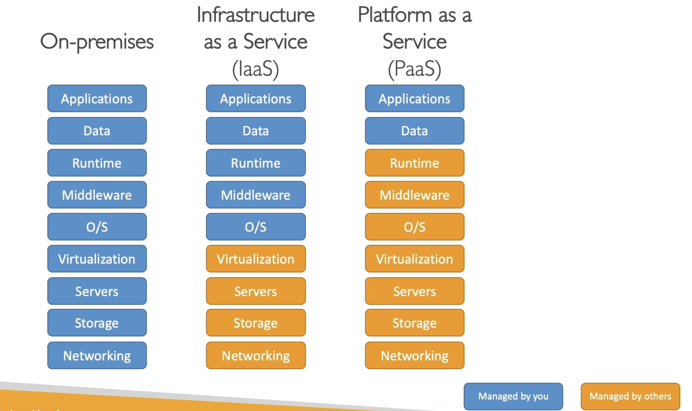

# Types of Cloud Computing
- Infrastructure as a Service (IaaS)
  - There are the building blocks for Cloud IT
  - With the IaaS, we are going to provide networking, computers, and data storage space in its raw form
  - Using this building blocks (like Legos), we will get High Level of Flexibility
  - With this, we can easily migrate from Traditional on Premises-IT to Cloud
- Platform as a Service (PaaS)
  - In this, we are going to remove the need for your organization to manage the underlying infrastructure &
  - You can focus on the deployment and management of your applications
- Software as a Service (SaaS)
  - This is a completed product that is going to be run and managed by the Service Provider

#### So if you want to compare all of these things:
Let us take an example -> **On premises** you are going to manage everything. This will involved your:
1. Applications
2. Data
3. Runtime 
4. Middleware
5. the OS (Operating System)
6. Virtualization
7. Servers 
8. Storage
9. Networking

With the **IaaS** (Infrastructure as a Service), we are going to manage the:
1. Application
2. Data
3. Runtime
4. Middleware &
5. OS

But all of the:
6. Virtualization
7. Servers
8. Storage &
9. Networking 
are going to be managed by others (In our case AWS)

With the **PaaS** (Platform as a Service), we manage even less, so everything from the runtime to the networking is managed by AWS and the only thing we care about when we use a platform as a service is our application and our data, meaning:
1. Application (we will manage this)
2. Data (we will manage this)
3. Runtime (AWS will handle it)
4. Middleware (AWS will handle it)
5. OS (AWS will handle it)
6. Virtualization (AWS will handle it)
7. Servers (AWS will handle it)
8. Storage (AWS will handle it)
9. Networking (AWS will handle it)

See the image below for better understanding:

Finally if you are using Software as a service (SaaS), Everything is going to be managed by the AWS 

## Examples of Cloud Computing Types
Well with the **IaaS**, we can use:
1. EC2 (With AWS)
2. GCP, Azure, Rackspace, Digital Ocean, Linode

With **PaaS**, also exists on AWS, and example include:
1. Elastic Beanstalk (on AWS)
2. Outside of AWS, the examples include:  Heroku, Google App Engine (GCP), Windows Azure (Microsoft)

For **SaaS**, we will also have this on AWS, that represents many services:
1. Rekognition for ML (AWS service)
2. Real world applications like Gmail (Google App), Dropbox, Zoom for Meetings

## Pricing of the Cloud
- AWS has 3 pricing fundamentals. It will follow the pay-as-you-go pricing model 
- For Compute: (Since for compute, it is involved in various services)
  - We are going to pay for exact compute time

- For Storage:
  - We are going to pay for the exact amount of the data stored in the cloud

- For Networking:
  - We are going to only pay when the data leaves the cloud. 
  - Any data that goes into the cloud is **Free**. (This solves the expensive issue of Traditional IT)